# Projects and dependencies analysis

This document provides a comprehensive overview of the projects and their dependencies in the context of upgrading to .NETCoreApp,Version=v10.0.

## Table of Contents

- [Executive Summary](#executive-Summary)
  - [Highlevel Metrics](#highlevel-metrics)
  - [Projects Compatibility](#projects-compatibility)
  - [Package Compatibility](#package-compatibility)
  - [API Compatibility](#api-compatibility)
- [Aggregate NuGet packages details](#aggregate-nuget-packages-details)
- [Top API Migration Challenges](#top-api-migration-challenges)
  - [Technologies and Features](#technologies-and-features)
  - [Most Frequent API Issues](#most-frequent-api-issues)
- [Projects Relationship Graph](#projects-relationship-graph)
- [Project Details](#project-details)

  - [C:\MyFiles\Development\oxyplot\Source\OxyPlot.SkiaSharp.Wpf\OxyPlot.SkiaSharp.Wpf.csproj](#c:myfilesdevelopmentoxyplotsourceoxyplotskiasharpwpfoxyplotskiasharpwpfcsproj)
  - [C:\MyFiles\Development\oxyplot\Source\OxyPlot.SkiaSharp\OxyPlot.SkiaSharp.csproj](#c:myfilesdevelopmentoxyplotsourceoxyplotskiasharpoxyplotskiasharpcsproj)
  - [C:\MyFiles\Development\oxyplot\Source\OxyPlot.Wpf.Shared\OxyPlot.Wpf.Shared.csproj](#c:myfilesdevelopmentoxyplotsourceoxyplotwpfsharedoxyplotwpfsharedcsproj)
  - [C:\MyFiles\Development\oxyplot\Source\OxyPlot\OxyPlot.csproj](#c:myfilesdevelopmentoxyplotsourceoxyplotoxyplotcsproj)
  - [demoTradingCore\demoTradingCore.csproj](#demotradingcoredemotradingcorecsproj)
  - [VisualHFT.Commons.WPF\VisualHFT.Commons.WPF.csproj](#visualhftcommonswpfvisualhftcommonswpfcsproj)
  - [VisualHFT.Commons\VisualHFT.Commons.csproj](#visualhftcommonsvisualhftcommonscsproj)
  - [VisualHFT.csproj](#visualhftcsproj)
  - [VisualHFT.DataRetriever.TestingFramework\VisualHFT.DataRetriever.TestingFramework.csproj](#visualhftdataretrievertestingframeworkvisualhftdataretrievertestingframeworkcsproj)
  - [VisualHFT.Plugins\MarketConnectors.BaseDAL\BitStamp.Net\BitStamp.Net.csproj](#visualhftpluginsmarketconnectorsbasedalbitstampnetbitstampnetcsproj)
  - [VisualHFT.Plugins\MarketConnectors.BaseDAL\Gemini.Net\Gemini.Net.csproj](#visualhftpluginsmarketconnectorsbasedalgemininetgemininetcsproj)
  - [VisualHFT.Plugins\MarketConnectors.Binance\MarketConnectors.Binance.csproj](#visualhftpluginsmarketconnectorsbinancemarketconnectorsbinancecsproj)
  - [VisualHFT.Plugins\MarketConnectors.Bitfinex\MarketConnectors.Bitfinex.csproj](#visualhftpluginsmarketconnectorsbitfinexmarketconnectorsbitfinexcsproj)
  - [VisualHFT.Plugins\MarketConnectors.BitStamp\MarketConnectors.BitStamp.csproj](#visualhftpluginsmarketconnectorsbitstampmarketconnectorsbitstampcsproj)
  - [VisualHFT.Plugins\MarketConnectors.Coinbase\MarketConnectors.Coinbase.csproj](#visualhftpluginsmarketconnectorscoinbasemarketconnectorscoinbasecsproj)
  - [VisualHFT.Plugins\MarketConnectors.Gemini\MarketConnectors.Gemini\MarketConnectors.Gemini.csproj](#visualhftpluginsmarketconnectorsgeminimarketconnectorsgeminimarketconnectorsgeminicsproj)
  - [VisualHFT.Plugins\MarketConnectors.Kraken\MarketConnectors.Kraken.csproj](#visualhftpluginsmarketconnectorskrakenmarketconnectorskrakencsproj)
  - [VisualHFT.Plugins\MarketConnectors.KuCoin\MarketConnectors.KuCoin.csproj](#visualhftpluginsmarketconnectorskucoinmarketconnectorskucoincsproj)
  - [VisualHFT.Plugins\MarketConnectors.WebSocket\MarketConnectors.WebSocket.csproj](#visualhftpluginsmarketconnectorswebsocketmarketconnectorswebsocketcsproj)
  - [VisualHFT.Plugins\Studies.LOBImbalance\Studies.LOBImbalance.csproj](#visualhftpluginsstudieslobimbalancestudieslobimbalancecsproj)
  - [VisualHFT.Plugins\Studies.MarketResilience.Test\Studies.MarketResilience.Test.csproj](#visualhftpluginsstudiesmarketresilienceteststudiesmarketresiliencetestcsproj)
  - [VisualHFT.Plugins\Studies.MarketResilience\Studies.MarketResilience.csproj](#visualhftpluginsstudiesmarketresiliencestudiesmarketresiliencecsproj)
  - [VisualHFT.Plugins\Studies.OTT_Ratio\Studies.OTT_Ratio.csproj](#visualhftpluginsstudiesott_ratiostudiesott_ratiocsproj)
  - [VisualHFT.Plugins\Studies.VPIN\Studies.VPIN.csproj](#visualhftpluginsstudiesvpinstudiesvpincsproj)
  - [VisualHFT.TriggerService.TestingFramework\VisualHFT.TriggerService.TestingFramework.csproj](#visualhfttriggerservicetestingframeworkvisualhfttriggerservicetestingframeworkcsproj)


## Executive Summary

### Highlevel Metrics

| Metric | Count | Status |
| :--- | :---: | :--- |
| Total Projects | 25 | All require upgrade |
| Total NuGet Packages | 78 | 3 need upgrade |
| Total Code Files | 600 |  |
| Total Code Files with Incidents | 203 |  |
| Total Lines of Code | 100923 |  |
| Total Number of Issues | 4041 |  |
| Estimated LOC to modify | 3998+ | at least 4.0% of codebase |

### Projects Compatibility

| Project | Target Framework | Difficulty | Package Issues | API Issues | Est. LOC Impact | Description |
| :--- | :---: | :---: | :---: | :---: | :---: | :--- |
| [C:\MyFiles\Development\oxyplot\Source\OxyPlot.SkiaSharp.Wpf\OxyPlot.SkiaSharp.Wpf.csproj](#c:myfilesdevelopmentoxyplotsourceoxyplotskiasharpwpfoxyplotskiasharpwpfcsproj) | net8.0-windows10.0.17763.0 | 🟡 Medium | 0 | 119 | 119+ | Wpf, Sdk Style = True |
| [C:\MyFiles\Development\oxyplot\Source\OxyPlot.SkiaSharp\OxyPlot.SkiaSharp.csproj](#c:myfilesdevelopmentoxyplotsourceoxyplotskiasharpoxyplotskiasharpcsproj) | net8.0-windows10.0.17763.0 | 🟢 Low | 0 | 0 |  | ClassLibrary, Sdk Style = True |
| [C:\MyFiles\Development\oxyplot\Source\OxyPlot.Wpf.Shared\OxyPlot.Wpf.Shared.csproj](#c:myfilesdevelopmentoxyplotsourceoxyplotwpfsharedoxyplotwpfsharedcsproj) | net8.0-windows8.0 | 🟡 Medium | 0 | 1268 | 1268+ | Wpf, Sdk Style = True |
| [C:\MyFiles\Development\oxyplot\Source\OxyPlot\OxyPlot.csproj](#c:myfilesdevelopmentoxyplotsourceoxyplotoxyplotcsproj) | net8.0-windows8.0 | 🟢 Low | 0 | 2 | 2+ | Wpf, Sdk Style = True |
| [demoTradingCore\demoTradingCore.csproj](#demotradingcoredemotradingcorecsproj) | net472 | 🟢 Low | 15 | 0 |  | WinForms, Sdk Style = True |
| [VisualHFT.Commons.WPF\VisualHFT.Commons.WPF.csproj](#visualhftcommonswpfvisualhftcommonswpfcsproj) | net8.0-windows | 🟡 Medium | 0 | 54 | 54+ | Wpf, Sdk Style = True |
| [VisualHFT.Commons\VisualHFT.Commons.csproj](#visualhftcommonsvisualhftcommonscsproj) | net8.0 | 🟢 Low | 0 | 98 | 98+ | ClassLibrary, Sdk Style = True |
| [VisualHFT.csproj](#visualhftcsproj) | net8.0-windows10.0.22621.0 | 🟡 Medium | 3 | 2114 | 2114+ | Wpf, Sdk Style = True |
| [VisualHFT.DataRetriever.TestingFramework\VisualHFT.DataRetriever.TestingFramework.csproj](#visualhftdataretrievertestingframeworkvisualhftdataretrievertestingframeworkcsproj) | net8.0-windows8.0 | 🟢 Low | 0 | 34 | 34+ | DotNetCoreApp, Sdk Style = True |
| [VisualHFT.Plugins\MarketConnectors.BaseDAL\BitStamp.Net\BitStamp.Net.csproj](#visualhftpluginsmarketconnectorsbasedalbitstampnetbitstampnetcsproj) | net8.0 | 🟢 Low | 0 | 7 | 7+ | ClassLibrary, Sdk Style = True |
| [VisualHFT.Plugins\MarketConnectors.BaseDAL\Gemini.Net\Gemini.Net.csproj](#visualhftpluginsmarketconnectorsbasedalgemininetgemininetcsproj) | net8.0 | 🟢 Low | 0 | 13 | 13+ | ClassLibrary, Sdk Style = True |
| [VisualHFT.Plugins\MarketConnectors.Binance\MarketConnectors.Binance.csproj](#visualhftpluginsmarketconnectorsbinancemarketconnectorsbinancecsproj) | net8.0-windows8.0 | 🟢 Low | 0 | 27 | 27+ | Wpf, Sdk Style = True |
| [VisualHFT.Plugins\MarketConnectors.Bitfinex\MarketConnectors.Bitfinex.csproj](#visualhftpluginsmarketconnectorsbitfinexmarketconnectorsbitfinexcsproj) | net8.0-windows8.0 | 🟢 Low | 0 | 25 | 25+ | Wpf, Sdk Style = True |
| [VisualHFT.Plugins\MarketConnectors.BitStamp\MarketConnectors.BitStamp.csproj](#visualhftpluginsmarketconnectorsbitstampmarketconnectorsbitstampcsproj) | net8.0-windows | 🟢 Low | 0 | 30 | 30+ | Wpf, Sdk Style = True |
| [VisualHFT.Plugins\MarketConnectors.Coinbase\MarketConnectors.Coinbase.csproj](#visualhftpluginsmarketconnectorscoinbasemarketconnectorscoinbasecsproj) | net8.0-windows | 🟢 Low | 0 | 25 | 25+ | Wpf, Sdk Style = True |
| [VisualHFT.Plugins\MarketConnectors.Gemini\MarketConnectors.Gemini\MarketConnectors.Gemini.csproj](#visualhftpluginsmarketconnectorsgeminimarketconnectorsgeminimarketconnectorsgeminicsproj) | net8.0-windows | 🟢 Low | 0 | 33 | 33+ | Wpf, Sdk Style = True |
| [VisualHFT.Plugins\MarketConnectors.Kraken\MarketConnectors.Kraken.csproj](#visualhftpluginsmarketconnectorskrakenmarketconnectorskrakencsproj) | net8.0-windows8.0 | 🟢 Low | 0 | 27 | 27+ | Wpf, Sdk Style = True |
| [VisualHFT.Plugins\MarketConnectors.KuCoin\MarketConnectors.KuCoin.csproj](#visualhftpluginsmarketconnectorskucoinmarketconnectorskucoincsproj) | net8.0-windows8.0 | 🟢 Low | 0 | 30 | 30+ | Wpf, Sdk Style = True |
| [VisualHFT.Plugins\MarketConnectors.WebSocket\MarketConnectors.WebSocket.csproj](#visualhftpluginsmarketconnectorswebsocketmarketconnectorswebsocketcsproj) | net8.0-windows8.0 | 🟢 Low | 0 | 12 | 12+ | Wpf, Sdk Style = True |
| [VisualHFT.Plugins\Studies.LOBImbalance\Studies.LOBImbalance.csproj](#visualhftpluginsstudieslobimbalancestudieslobimbalancecsproj) | net8.0-windows8.0 | 🟢 Low | 0 | 19 | 19+ | Wpf, Sdk Style = True |
| [VisualHFT.Plugins\Studies.MarketResilience.Test\Studies.MarketResilience.Test.csproj](#visualhftpluginsstudiesmarketresilienceteststudiesmarketresiliencetestcsproj) | net8.0-windows8.0 | 🟢 Low | 0 | 0 |  | DotNetCoreApp, Sdk Style = True |
| [VisualHFT.Plugins\Studies.MarketResilience\Studies.MarketResilience.csproj](#visualhftpluginsstudiesmarketresiliencestudiesmarketresiliencecsproj) | net8.0-windows8.0 | 🟢 Low | 0 | 20 | 20+ | Wpf, Sdk Style = True |
| [VisualHFT.Plugins\Studies.OTT_Ratio\Studies.OTT_Ratio.csproj](#visualhftpluginsstudiesott_ratiostudiesott_ratiocsproj) | net8.0-windows8.0 | 🟢 Low | 0 | 19 | 19+ | Wpf, Sdk Style = True |
| [VisualHFT.Plugins\Studies.VPIN\Studies.VPIN.csproj](#visualhftpluginsstudiesvpinstudiesvpincsproj) | net8.0-windows8.0 | 🟢 Low | 0 | 19 | 19+ | Wpf, Sdk Style = True |
| [VisualHFT.TriggerService.TestingFramework\VisualHFT.TriggerService.TestingFramework.csproj](#visualhfttriggerservicetestingframeworkvisualhfttriggerservicetestingframeworkcsproj) | net8.0-windows10.0.22621.0 | 🟢 Low | 0 | 3 | 3+ | DotNetCoreApp, Sdk Style = True |

### Package Compatibility

| Status | Count | Percentage |
| :--- | :---: | :---: |
| ✅ Compatible | 75 | 96.2% |
| ⚠️ Incompatible | 3 | 3.8% |
| 🔄 Upgrade Recommended | 0 | 0.0% |
| ***Total NuGet Packages*** | ***78*** | ***100%*** |

### API Compatibility

| Category | Count | Impact |
| :--- | :---: | :--- |
| 🔴 Binary Incompatible | 3692 | High - Require code changes |
| 🟡 Source Incompatible | 164 | Medium - Needs re-compilation and potential conflicting API error fixing |
| 🔵 Behavioral change | 142 | Low - Behavioral changes that may require testing at runtime |
| ✅ Compatible | 69455 |  |
| ***Total APIs Analyzed*** | ***73453*** |  |

## Aggregate NuGet packages details

| Package | Current Version | Suggested Version | Projects | Description |
| :--- | :---: | :---: | :--- | :--- |
| Binance.Net | 12.11.4 |  | [MarketConnectors.Binance.csproj](#visualhftpluginsmarketconnectorsbinancemarketconnectorsbinancecsproj) | ✅Compatible |
| Bitfinex.Net | 10.10.4 |  | [MarketConnectors.Bitfinex.csproj](#visualhftpluginsmarketconnectorsbitfinexmarketconnectorsbitfinexcsproj) | ✅Compatible |
| BouncyCastle.Cryptography | 2.6.2 |  | [demoTradingCore.csproj](#demotradingcoredemotradingcorecsproj) | ✅Compatible |
| coverlet.collector | 10.0.0 |  | [Studies.MarketResilience.Test.csproj](#visualhftpluginsstudiesmarketresilienceteststudiesmarketresiliencetestcsproj)<br/>[VisualHFT.DataRetriever.TestingFramework.csproj](#visualhftdataretrievertestingframeworkvisualhftdataretrievertestingframeworkcsproj)<br/>[VisualHFT.TriggerService.TestingFramework.csproj](#visualhfttriggerservicetestingframeworkvisualhfttriggerservicetestingframeworkcsproj) | ✅Compatible |
| CryptoExchange.Net | 11.1.1 |  | [MarketConnectors.BitStamp.csproj](#visualhftpluginsmarketconnectorsbitstampmarketconnectorsbitstampcsproj)<br/>[MarketConnectors.Coinbase.csproj](#visualhftpluginsmarketconnectorscoinbasemarketconnectorscoinbasecsproj)<br/>[MarketConnectors.Gemini.csproj](#visualhftpluginsmarketconnectorsgeminimarketconnectorsgeminimarketconnectorsgeminicsproj) | ✅Compatible |
| DigitalRuby.ExchangeSharp | 1.2.1 |  | [demoTradingCore.csproj](#demotradingcoredemotradingcorecsproj) | ✅Compatible |
| DotNet.ReproducibleBuilds | 2.0.2 |  | [OxyPlot.csproj](#c:myfilesdevelopmentoxyplotsourceoxyplotoxyplotcsproj)<br/>[OxyPlot.SkiaSharp.csproj](#c:myfilesdevelopmentoxyplotsourceoxyplotskiasharpoxyplotskiasharpcsproj)<br/>[OxyPlot.SkiaSharp.Wpf.csproj](#c:myfilesdevelopmentoxyplotsourceoxyplotskiasharpwpfoxyplotskiasharpwpfcsproj)<br/>[OxyPlot.Wpf.Shared.csproj](#c:myfilesdevelopmentoxyplotsourceoxyplotwpfsharedoxyplotwpfsharedcsproj) | ✅Compatible |
| EntityFramework | 6.5.2 |  | [demoTradingCore.csproj](#demotradingcoredemotradingcorecsproj) | ✅Compatible |
| Fody | 6.9.3 |  | [VisualHFT.csproj](#visualhftcsproj) | ✅Compatible |
| JKorf.Coinbase.Net | 3.9.3 |  | [MarketConnectors.Coinbase.csproj](#visualhftpluginsmarketconnectorscoinbasemarketconnectorscoinbasecsproj) | ✅Compatible |
| KrakenExchange.Net | 7.9.1 |  | [MarketConnectors.Kraken.csproj](#visualhftpluginsmarketconnectorskrakenmarketconnectorskrakencsproj) | ✅Compatible |
| Kucoin.Net | 8.11.0 |  | [MarketConnectors.KuCoin.csproj](#visualhftpluginsmarketconnectorskucoinmarketconnectorskucoincsproj) | ✅Compatible |
| log4net | 3.3.1 |  | [MarketConnectors.Binance.csproj](#visualhftpluginsmarketconnectorsbinancemarketconnectorsbinancecsproj)<br/>[MarketConnectors.Bitfinex.csproj](#visualhftpluginsmarketconnectorsbitfinexmarketconnectorsbitfinexcsproj)<br/>[MarketConnectors.Kraken.csproj](#visualhftpluginsmarketconnectorskrakenmarketconnectorskrakencsproj)<br/>[MarketConnectors.KuCoin.csproj](#visualhftpluginsmarketconnectorskucoinmarketconnectorskucoincsproj)<br/>[VisualHFT.Commons.csproj](#visualhftcommonsvisualhftcommonscsproj)<br/>[VisualHFT.csproj](#visualhftcsproj) | ✅Compatible |
| MaterialDesignColors | 5.3.1 | 5.2.1 | [VisualHFT.csproj](#visualhftcsproj) | ⚠️NuGet package is incompatible |
| MaterialDesignThemes | 5.3.1 | 5.2.1 | [VisualHFT.csproj](#visualhftcsproj) | ⚠️NuGet package is incompatible |
| MaterialDesignThemes.MahApps | 5.3.1 | 5.2.1 | [VisualHFT.csproj](#visualhftcsproj) | ⚠️NuGet package is incompatible |
| Microsoft.AspNet.SignalR.Client | 2.4.3 |  | [demoTradingCore.csproj](#demotradingcoredemotradingcorecsproj) | ✅Compatible |
| Microsoft.Bcl.AsyncInterfaces | 10.0.7 |  | [demoTradingCore.csproj](#demotradingcoredemotradingcorecsproj) | ✅Compatible |
| Microsoft.Bcl.Memory | 10.0.7 |  | [demoTradingCore.csproj](#demotradingcoredemotradingcorecsproj) | ✅Compatible |
| Microsoft.Bcl.TimeProvider | 10.0.7 |  | [demoTradingCore.csproj](#demotradingcoredemotradingcorecsproj) | ✅Compatible |
| Microsoft.Extensions.DependencyInjection | 10.0.7 |  | [demoTradingCore.csproj](#demotradingcoredemotradingcorecsproj) | ✅Compatible |
| Microsoft.Extensions.DependencyInjection.Abstractions | 10.0.7 |  | [demoTradingCore.csproj](#demotradingcoredemotradingcorecsproj) | ✅Compatible |
| Microsoft.Extensions.Logging | 10.0.7 |  | [demoTradingCore.csproj](#demotradingcoredemotradingcorecsproj) | ✅Compatible |
| Microsoft.Extensions.Logging.Abstractions | 10.0.7 |  | [demoTradingCore.csproj](#demotradingcoredemotradingcorecsproj) | ✅Compatible |
| Microsoft.Extensions.ObjectPool | 10.0.7 |  | [VisualHFT.Commons.csproj](#visualhftcommonsvisualhftcommonscsproj) | ✅Compatible |
| Microsoft.Extensions.Options | 10.0.7 |  | [demoTradingCore.csproj](#demotradingcoredemotradingcorecsproj) | ✅Compatible |
| Microsoft.Extensions.Primitives | 10.0.7 |  | [demoTradingCore.csproj](#demotradingcoredemotradingcorecsproj) | ✅Compatible |
| Microsoft.Identity.Abstractions | 12.0.0 |  | [demoTradingCore.csproj](#demotradingcoredemotradingcorecsproj) | ✅Compatible |
| Microsoft.IdentityModel.Abstractions | 8.17.0 |  | [demoTradingCore.csproj](#demotradingcoredemotradingcorecsproj) | ✅Compatible |
| Microsoft.IdentityModel.JsonWebTokens | 8.17.0 |  | [demoTradingCore.csproj](#demotradingcoredemotradingcorecsproj) | ✅Compatible |
| Microsoft.IdentityModel.Logging | 8.17.0 |  | [demoTradingCore.csproj](#demotradingcoredemotradingcorecsproj) | ✅Compatible |
| Microsoft.IdentityModel.Tokens | 8.17.0 |  | [demoTradingCore.csproj](#demotradingcoredemotradingcorecsproj) | ✅Compatible |
| Microsoft.NET.Test.Sdk | 18.5.1 |  | [Studies.MarketResilience.Test.csproj](#visualhftpluginsstudiesmarketresilienceteststudiesmarketresiliencetestcsproj)<br/>[VisualHFT.DataRetriever.TestingFramework.csproj](#visualhftdataretrievertestingframeworkvisualhftdataretrievertestingframeworkcsproj)<br/>[VisualHFT.TriggerService.TestingFramework.csproj](#visualhfttriggerservicetestingframeworkvisualhfttriggerservicetestingframeworkcsproj) | ✅Compatible |
| Moq | 4.20.72 |  | [VisualHFT.DataRetriever.TestingFramework.csproj](#visualhftdataretrievertestingframeworkvisualhftdataretrievertestingframeworkcsproj) | ✅Compatible |
| Newtonsoft.Json | 13.0.4 |  | [BitStamp.Net.csproj](#visualhftpluginsmarketconnectorsbasedalbitstampnetbitstampnetcsproj)<br/>[demoTradingCore.csproj](#demotradingcoredemotradingcorecsproj)<br/>[Gemini.Net.csproj](#visualhftpluginsmarketconnectorsbasedalgemininetgemininetcsproj)<br/>[MarketConnectors.Coinbase.csproj](#visualhftpluginsmarketconnectorscoinbasemarketconnectorscoinbasecsproj)<br/>[VisualHFT.Commons.csproj](#visualhftcommonsvisualhftcommonscsproj)<br/>[VisualHFT.csproj](#visualhftcsproj) | ✅Compatible |
| NLog | 6.1.2 |  | [demoTradingCore.csproj](#demotradingcoredemotradingcorecsproj) | ✅Compatible |
| Prism.Core | 9.0.537 |  | [VisualHFT.csproj](#visualhftcsproj) | ✅Compatible |
| PropertyChanged.Fody | 4.1.0 |  | [VisualHFT.Commons.WPF.csproj](#visualhftcommonswpfvisualhftcommonswpfcsproj)<br/>[VisualHFT.csproj](#visualhftcsproj) | ✅Compatible |
| SkiaSharp | 3.119.2 |  | [OxyPlot.SkiaSharp.csproj](#c:myfilesdevelopmentoxyplotsourceoxyplotskiasharpoxyplotskiasharpcsproj) | ✅Compatible |
| SkiaSharp.HarfBuzz | 3.119.2 |  | [OxyPlot.SkiaSharp.csproj](#c:myfilesdevelopmentoxyplotsourceoxyplotskiasharpoxyplotskiasharpcsproj) | ✅Compatible |
| SkiaSharp.Views.Desktop.Common | 3.119.2 |  | [OxyPlot.SkiaSharp.Wpf.csproj](#c:myfilesdevelopmentoxyplotsourceoxyplotskiasharpwpfoxyplotskiasharpwpfcsproj) | ✅Compatible |
| SocketIO.Core | 3.1.2 |  | [demoTradingCore.csproj](#demotradingcoredemotradingcorecsproj) | ✅Compatible |
| SocketIO.Serializer.Core | 3.1.2 |  | [demoTradingCore.csproj](#demotradingcoredemotradingcorecsproj) | ✅Compatible |
| SocketIO.Serializer.SystemTextJson | 3.1.2 |  | [demoTradingCore.csproj](#demotradingcoredemotradingcorecsproj) | ✅Compatible |
| SocketIOClient | 4.0.3 |  | [demoTradingCore.csproj](#demotradingcoredemotradingcorecsproj) | ✅Compatible |
| SocketIOClient.Common | 4.0.0 |  | [demoTradingCore.csproj](#demotradingcoredemotradingcorecsproj) | ✅Compatible |
| SocketIOClient.Serializer | 4.0.0.1 |  | [demoTradingCore.csproj](#demotradingcoredemotradingcorecsproj) | ✅Compatible |
| SocketIOClient.Serializer.NewtonsoftJson | 4.0.0.1 |  | [demoTradingCore.csproj](#demotradingcoredemotradingcorecsproj) | ✅Compatible |
| System.Buffers | 4.6.1 |  | [demoTradingCore.csproj](#demotradingcoredemotradingcorecsproj) | NuGet package functionality is included with framework reference |
| System.Collections | 4.3.0 |  | [demoTradingCore.csproj](#demotradingcoredemotradingcorecsproj) | NuGet package functionality is included with framework reference |
| System.Collections.Concurrent | 4.3.0 |  | [demoTradingCore.csproj](#demotradingcoredemotradingcorecsproj) | NuGet package functionality is included with framework reference |
| System.Configuration.ConfigurationManager | 10.0.7 |  | [demoTradingCore.csproj](#demotradingcoredemotradingcorecsproj) | ✅Compatible |
| System.Diagnostics.DiagnosticSource | 10.0.7 |  | [demoTradingCore.csproj](#demotradingcoredemotradingcorecsproj) | ✅Compatible |
| System.Diagnostics.PerformanceCounter | 10.0.7 |  | [VisualHFT.Commons.csproj](#visualhftcommonsvisualhftcommonscsproj) | ✅Compatible |
| System.IdentityModel.Tokens.Jwt | 8.17.0 |  | [demoTradingCore.csproj](#demotradingcoredemotradingcorecsproj) | ✅Compatible |
| System.IO | 4.3.0 |  | [demoTradingCore.csproj](#demotradingcoredemotradingcorecsproj) | NuGet package functionality is included with framework reference |
| System.IO.Pipelines | 10.0.7 |  | [demoTradingCore.csproj](#demotradingcoredemotradingcorecsproj) | ✅Compatible |
| System.Memory | 4.6.3 |  | [demoTradingCore.csproj](#demotradingcoredemotradingcorecsproj) | NuGet package functionality is included with framework reference |
| System.Net.Http | 4.3.4 |  | [demoTradingCore.csproj](#demotradingcoredemotradingcorecsproj) | NuGet package functionality is included with framework reference |
| System.Numerics.Vectors | 4.6.1 |  | [demoTradingCore.csproj](#demotradingcoredemotradingcorecsproj) | NuGet package functionality is included with framework reference |
| System.Reactive | 6.1.0 |  | [demoTradingCore.csproj](#demotradingcoredemotradingcorecsproj) | ✅Compatible |
| System.Runtime | 4.3.1 |  | [demoTradingCore.csproj](#demotradingcoredemotradingcorecsproj) | NuGet package functionality is included with framework reference |
| System.Runtime.CompilerServices.Unsafe | 6.1.2 |  | [demoTradingCore.csproj](#demotradingcoredemotradingcorecsproj) | ✅Compatible |
| System.Security.AccessControl | 6.0.1 |  | [demoTradingCore.csproj](#demotradingcoredemotradingcorecsproj) | ✅Compatible |
| System.Security.Cryptography.Algorithms | 4.3.1 |  | [demoTradingCore.csproj](#demotradingcoredemotradingcorecsproj) | NuGet package functionality is included with framework reference |
| System.Security.Cryptography.Encoding | 4.3.0 |  | [demoTradingCore.csproj](#demotradingcoredemotradingcorecsproj) | NuGet package functionality is included with framework reference |
| System.Security.Cryptography.Primitives | 4.3.0 |  | [demoTradingCore.csproj](#demotradingcoredemotradingcorecsproj) | NuGet package functionality is included with framework reference |
| System.Security.Cryptography.X509Certificates | 4.3.2 |  | [demoTradingCore.csproj](#demotradingcoredemotradingcorecsproj) | NuGet package functionality is included with framework reference |
| System.Security.Permissions | 10.0.7 |  | [demoTradingCore.csproj](#demotradingcoredemotradingcorecsproj) | ✅Compatible |
| System.Security.Principal.Windows | 5.0.0 |  | [demoTradingCore.csproj](#demotradingcoredemotradingcorecsproj) | NuGet package functionality is included with framework reference |
| System.Text.Encodings.Web | 10.0.7 |  | [demoTradingCore.csproj](#demotradingcoredemotradingcorecsproj) | ✅Compatible |
| System.Text.Json | 10.0.7 |  | [demoTradingCore.csproj](#demotradingcoredemotradingcorecsproj)<br/>[Studies.MarketResilience.csproj](#visualhftpluginsstudiesmarketresiliencestudiesmarketresiliencecsproj) | ✅Compatible |
| System.Threading.Tasks.Extensions | 4.6.3 |  | [demoTradingCore.csproj](#demotradingcoredemotradingcorecsproj) | NuGet package functionality is included with framework reference |
| System.ValueTuple | 4.6.2 |  | [demoTradingCore.csproj](#demotradingcoredemotradingcorecsproj) | NuGet package functionality is included with framework reference |
| WatsonWebsocket | 4.1.8 |  | [demoTradingCore.csproj](#demotradingcoredemotradingcorecsproj) | ✅Compatible |
| Websocket.Client | 5.3.0 |  | [Gemini.Net.csproj](#visualhftpluginsmarketconnectorsbasedalgemininetgemininetcsproj)<br/>[MarketConnectors.BitStamp.csproj](#visualhftpluginsmarketconnectorsbitstampmarketconnectorsbitstampcsproj)<br/>[MarketConnectors.Gemini.csproj](#visualhftpluginsmarketconnectorsgeminimarketconnectorsgeminimarketconnectorsgeminicsproj) | ✅Compatible |
| xunit.runner.visualstudio | 3.1.5 |  | [Studies.MarketResilience.Test.csproj](#visualhftpluginsstudiesmarketresilienceteststudiesmarketresiliencetestcsproj)<br/>[VisualHFT.DataRetriever.TestingFramework.csproj](#visualhftdataretrievertestingframeworkvisualhftdataretrievertestingframeworkcsproj)<br/>[VisualHFT.TriggerService.TestingFramework.csproj](#visualhfttriggerservicetestingframeworkvisualhfttriggerservicetestingframeworkcsproj) | ✅Compatible |
| xunit.v3 | 3.2.2 |  | [Studies.MarketResilience.Test.csproj](#visualhftpluginsstudiesmarketresilienceteststudiesmarketresiliencetestcsproj)<br/>[VisualHFT.DataRetriever.TestingFramework.csproj](#visualhftdataretrievertestingframeworkvisualhftdataretrievertestingframeworkcsproj)<br/>[VisualHFT.TriggerService.TestingFramework.csproj](#visualhfttriggerservicetestingframeworkvisualhfttriggerservicetestingframeworkcsproj) | ✅Compatible |

## Top API Migration Challenges

### Technologies and Features

| Technology | Issues | Percentage | Migration Path |
| :--- | :---: | :---: | :--- |
| WPF (Windows Presentation Foundation) | 1826 | 45.7% | WPF APIs for building Windows desktop applications with XAML-based UI that are available in .NET on Windows. WPF provides rich desktop UI capabilities with data binding and styling. Enable Windows Desktop support: Option 1 (Recommended): Target net9.0-windows; Option 2: Add <UseWindowsDesktop>true</UseWindowsDesktop>. |
| Printing & XAML Infrastructure | 45 | 1.1% | WPF printing subsystem and XAML services that are Windows-specific and have limited cross-platform support. These APIs are specific to Windows printing infrastructure. Use Windows Compatibility Pack or redesign for cross-platform scenarios. |

### Most Frequent API Issues

| API | Count | Percentage | Category |
| :--- | :---: | :---: | :--- |
| T:System.Windows.Input.Key | 174 | 4.4% | Binary Incompatible |
| T:System.Windows.Visibility | 163 | 4.1% | Binary Incompatible |
| T:System.Windows.Controls.Label | 157 | 3.9% | Binary Incompatible |
| T:System.Windows.Application | 117 | 2.9% | Binary Incompatible |
| T:System.Windows.DependencyProperty | 83 | 2.1% | Binary Incompatible |
| T:System.Windows.RoutedEventHandler | 80 | 2.0% | Binary Incompatible |
| T:System.Uri | 71 | 1.8% | Behavioral Change |
| P:System.Windows.FrameworkElement.DataContext | 70 | 1.8% | Binary Incompatible |
| T:System.Windows.Point | 69 | 1.7% | Binary Incompatible |
| T:System.Windows.Controls.Button | 67 | 1.7% | Binary Incompatible |
| M:System.Windows.Controls.UserControl.#ctor | 62 | 1.6% | Binary Incompatible |
| T:System.Windows.VerticalAlignment | 56 | 1.4% | Binary Incompatible |
| M:System.Windows.Point.#ctor(System.Double,System.Double) | 55 | 1.4% | Binary Incompatible |
| M:System.TimeSpan.FromSeconds(System.Double) | 51 | 1.3% | Source Incompatible |
| T:System.Windows.Threading.DispatcherPriority | 50 | 1.3% | Binary Incompatible |
| T:System.Windows.Controls.UserControl | 48 | 1.2% | Binary Incompatible |
| T:System.Windows.HorizontalAlignment | 48 | 1.2% | Binary Incompatible |
| T:System.Windows.MessageBoxResult | 48 | 1.2% | Binary Incompatible |
| T:System.Windows.MessageBoxButton | 46 | 1.2% | Binary Incompatible |
| M:System.Uri.#ctor(System.String,System.UriKind) | 45 | 1.1% | Behavioral Change |
| M:System.Windows.Application.LoadComponent(System.Object,System.Uri) | 44 | 1.1% | Binary Incompatible |
| T:System.Windows.MessageBoxImage | 44 | 1.1% | Binary Incompatible |
| T:System.Windows.Markup.IComponentConnector | 43 | 1.1% | Binary Incompatible |
| T:System.Windows.FrameworkElement | 42 | 1.1% | Binary Incompatible |
| T:System.Windows.RoutedEventArgs | 41 | 1.0% | Binary Incompatible |
| P:System.Windows.Application.Current | 36 | 0.9% | Binary Incompatible |
| T:System.Windows.Controls.Primitives.Popup | 35 | 0.9% | Binary Incompatible |
| T:System.Windows.Controls.Grid | 35 | 0.9% | Binary Incompatible |
| T:System.Windows.Threading.Dispatcher | 35 | 0.9% | Binary Incompatible |
| P:System.Windows.Threading.DispatcherObject.Dispatcher | 33 | 0.8% | Binary Incompatible |
| T:System.Diagnostics.PerformanceCounter | 31 | 0.8% | Source Incompatible |
| T:System.Windows.MessageBox | 30 | 0.8% | Binary Incompatible |
| E:System.Windows.Controls.Primitives.ButtonBase.Click | 29 | 0.7% | Binary Incompatible |
| P:System.Windows.RoutedEventArgs.Handled | 27 | 0.7% | Binary Incompatible |
| T:System.Windows.DependencyObject | 27 | 0.7% | Binary Incompatible |
| T:System.Windows.Controls.TextBlock | 26 | 0.7% | Binary Incompatible |
| M:System.Windows.DependencyObject.SetValue(System.Windows.DependencyProperty,System.Object) | 25 | 0.6% | Binary Incompatible |
| M:System.Windows.DependencyObject.GetValue(System.Windows.DependencyProperty) | 25 | 0.6% | Binary Incompatible |
| T:System.Windows.Threading.DispatcherOperation | 25 | 0.6% | Binary Incompatible |
| M:System.Windows.Window.#ctor | 25 | 0.6% | Binary Incompatible |
| T:System.Windows.Threading.DispatcherTimer | 23 | 0.6% | Binary Incompatible |
| T:System.Windows.Input.MouseEventHandler | 22 | 0.6% | Binary Incompatible |
| M:System.Windows.MessageBox.Show(System.String,System.String,System.Windows.MessageBoxButton,System.Windows.MessageBoxImage) | 22 | 0.6% | Binary Incompatible |
| T:System.Windows.Data.IValueConverter | 19 | 0.5% | Binary Incompatible |
| T:System.Windows.Size | 19 | 0.5% | Binary Incompatible |
| F:System.Windows.Visibility.Visible | 18 | 0.5% | Binary Incompatible |
| T:System.Windows.Thickness | 18 | 0.5% | Binary Incompatible |
| T:System.Windows.Shapes.Line | 18 | 0.5% | Binary Incompatible |
| T:System.Windows.Controls.ControlTemplate | 18 | 0.5% | Binary Incompatible |
| T:System.Windows.Input.Cursor | 18 | 0.5% | Binary Incompatible |

## Projects Relationship Graph

Legend:
📦 SDK-style project
⚙️ Classic project

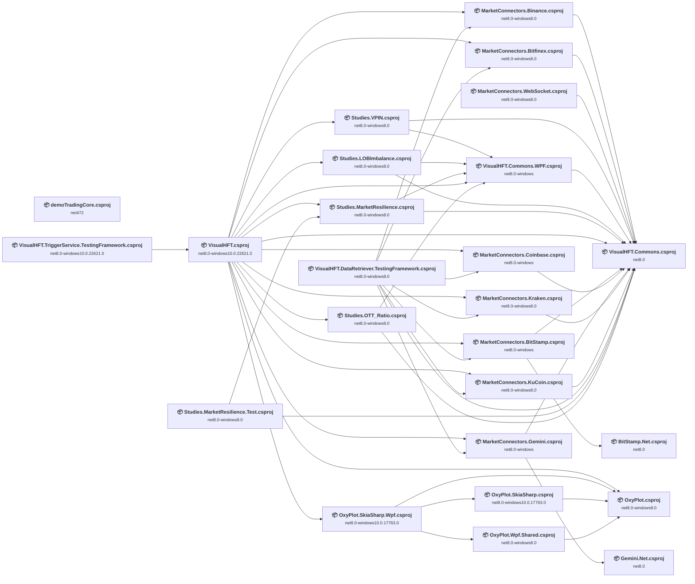

## Project Details

<a id="c:myfilesdevelopmentoxyplotsourceoxyplotskiasharpwpfoxyplotskiasharpwpfcsproj"></a>
### C:\MyFiles\Development\oxyplot\Source\OxyPlot.SkiaSharp.Wpf\OxyPlot.SkiaSharp.Wpf.csproj

#### Project Info

- **Current Target Framework:** net8.0-windows10.0.17763.0
- **Proposed Target Framework:** net10.0-windows
- **SDK-style**: True
- **Project Kind:** Wpf
- **Dependencies**: 3
- **Dependants**: 1
- **Number of Files**: 3
- **Number of Files with Incidents**: 3
- **Lines of Code**: 349
- **Estimated LOC to modify**: 119+ (at least 34.1% of the project)

#### Dependency Graph

Legend:
📦 SDK-style project
⚙️ Classic project

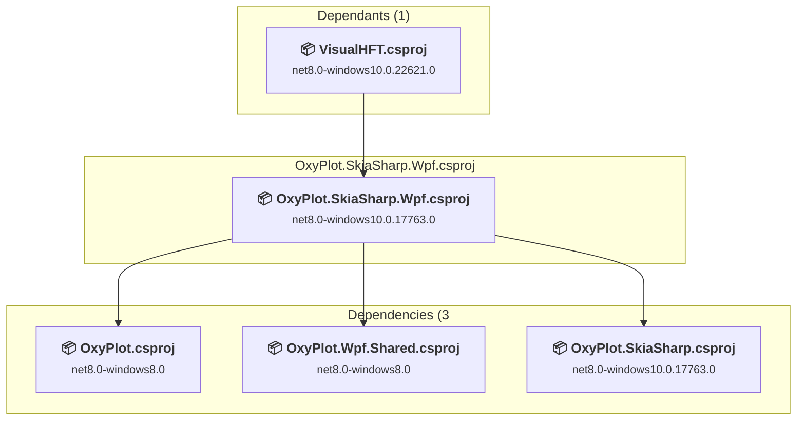

### API Compatibility

| Category | Count | Impact |
| :--- | :---: | :--- |
| 🔴 Binary Incompatible | 119 | High - Require code changes |
| 🟡 Source Incompatible | 0 | Medium - Needs re-compilation and potential conflicting API error fixing |
| 🔵 Behavioral change | 0 | Low - Behavioral changes that may require testing at runtime |
| ✅ Compatible | 144 |  |
| ***Total APIs Analyzed*** | ***263*** |  |

#### Project Package References

| Package | Type | Current Version | Suggested Version | Description |
| :--- | :---: | :---: | :---: | :--- |
| DotNet.ReproducibleBuilds | Explicit | 2.0.2 |  | ✅Compatible |
| SkiaSharp.Views.Desktop.Common | Explicit | 3.119.2 |  | ✅Compatible |

#### Project Technologies and Features

| Technology | Issues | Percentage | Migration Path |
| :--- | :---: | :---: | :--- |
| WPF (Windows Presentation Foundation) | 77 | 64.7% | WPF APIs for building Windows desktop applications with XAML-based UI that are available in .NET on Windows. WPF provides rich desktop UI capabilities with data binding and styling. Enable Windows Desktop support: Option 1 (Recommended): Target net9.0-windows; Option 2: Add <UseWindowsDesktop>true</UseWindowsDesktop>. |

<a id="c:myfilesdevelopmentoxyplotsourceoxyplotskiasharpoxyplotskiasharpcsproj"></a>
### C:\MyFiles\Development\oxyplot\Source\OxyPlot.SkiaSharp\OxyPlot.SkiaSharp.csproj

#### Project Info

- **Current Target Framework:** net8.0-windows10.0.17763.0
- **Proposed Target Framework:** net10.0--windows10.0.17763.0
- **SDK-style**: True
- **Project Kind:** ClassLibrary
- **Dependencies**: 1
- **Dependants**: 1
- **Number of Files**: 7
- **Number of Files with Incidents**: 1
- **Lines of Code**: 1376
- **Estimated LOC to modify**: 0+ (at least 0.0% of the project)

#### Dependency Graph

Legend:
📦 SDK-style project
⚙️ Classic project

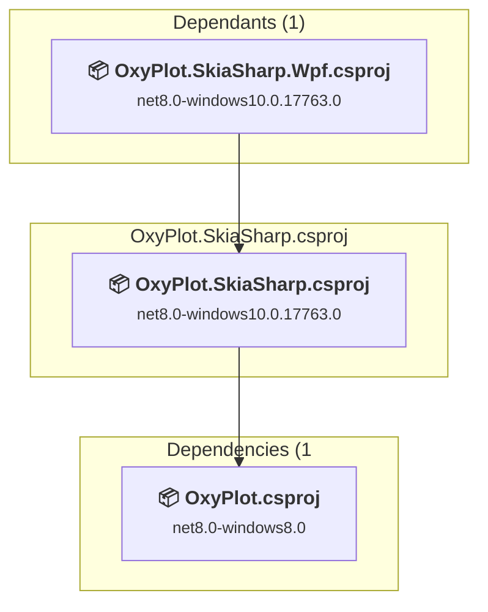

### API Compatibility

| Category | Count | Impact |
| :--- | :---: | :--- |
| 🔴 Binary Incompatible | 0 | High - Require code changes |
| 🟡 Source Incompatible | 0 | Medium - Needs re-compilation and potential conflicting API error fixing |
| 🔵 Behavioral change | 0 | Low - Behavioral changes that may require testing at runtime |
| ✅ Compatible | 917 |  |
| ***Total APIs Analyzed*** | ***917*** |  |

#### Project Package References

| Package | Type | Current Version | Suggested Version | Description |
| :--- | :---: | :---: | :---: | :--- |
| DotNet.ReproducibleBuilds | Explicit | 2.0.2 |  | ✅Compatible |
| SkiaSharp | Explicit | 3.119.2 |  | ✅Compatible |
| SkiaSharp.HarfBuzz | Explicit | 3.119.2 |  | ✅Compatible |

<a id="c:myfilesdevelopmentoxyplotsourceoxyplotwpfsharedoxyplotwpfsharedcsproj"></a>
### C:\MyFiles\Development\oxyplot\Source\OxyPlot.Wpf.Shared\OxyPlot.Wpf.Shared.csproj

#### Project Info

- **Current Target Framework:** net8.0-windows8.0
- **Proposed Target Framework:** net10.0-windows
- **SDK-style**: True
- **Project Kind:** Wpf
- **Dependencies**: 1
- **Dependants**: 1
- **Number of Files**: 13
- **Number of Files with Incidents**: 12
- **Lines of Code**: 2326
- **Estimated LOC to modify**: 1268+ (at least 54.5% of the project)

#### Dependency Graph

Legend:
📦 SDK-style project
⚙️ Classic project

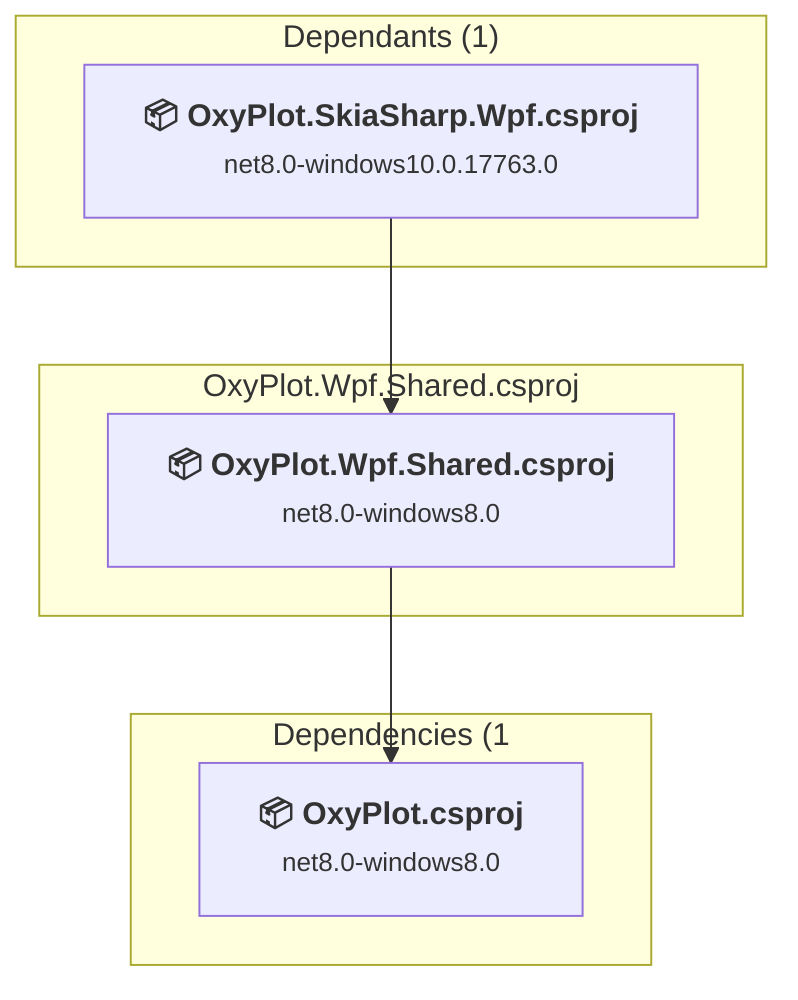

### API Compatibility

| Category | Count | Impact |
| :--- | :---: | :--- |
| 🔴 Binary Incompatible | 1268 | High - Require code changes |
| 🟡 Source Incompatible | 0 | Medium - Needs re-compilation and potential conflicting API error fixing |
| 🔵 Behavioral change | 0 | Low - Behavioral changes that may require testing at runtime |
| ✅ Compatible | 543 |  |
| ***Total APIs Analyzed*** | ***1811*** |  |

#### Project Package References

| Package | Type | Current Version | Suggested Version | Description |
| :--- | :---: | :---: | :---: | :--- |
| DotNet.ReproducibleBuilds | Explicit | 2.0.2 |  | ✅Compatible |

#### Project Technologies and Features

| Technology | Issues | Percentage | Migration Path |
| :--- | :---: | :---: | :--- |
| WPF (Windows Presentation Foundation) | 626 | 49.4% | WPF APIs for building Windows desktop applications with XAML-based UI that are available in .NET on Windows. WPF provides rich desktop UI capabilities with data binding and styling. Enable Windows Desktop support: Option 1 (Recommended): Target net9.0-windows; Option 2: Add <UseWindowsDesktop>true</UseWindowsDesktop>. |

<a id="c:myfilesdevelopmentoxyplotsourceoxyplotoxyplotcsproj"></a>
### C:\MyFiles\Development\oxyplot\Source\OxyPlot\OxyPlot.csproj

#### Project Info

- **Current Target Framework:** net8.0-windows8.0
- **Proposed Target Framework:** net10.0-windows
- **SDK-style**: True
- **Project Kind:** Wpf
- **Dependencies**: 0
- **Dependants**: 4
- **Number of Files**: 275
- **Number of Files with Incidents**: 2
- **Lines of Code**: 53365
- **Estimated LOC to modify**: 2+ (at least 0.0% of the project)

#### Dependency Graph

Legend:
📦 SDK-style project
⚙️ Classic project

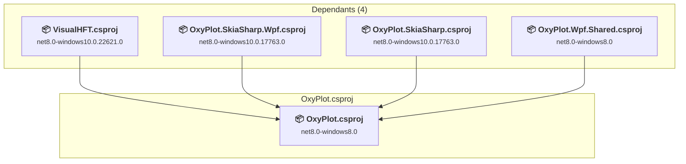

### API Compatibility

| Category | Count | Impact |
| :--- | :---: | :--- |
| 🔴 Binary Incompatible | 0 | High - Require code changes |
| 🟡 Source Incompatible | 2 | Medium - Needs re-compilation and potential conflicting API error fixing |
| 🔵 Behavioral change | 0 | Low - Behavioral changes that may require testing at runtime |
| ✅ Compatible | 24913 |  |
| ***Total APIs Analyzed*** | ***24915*** |  |

#### Project Package References

| Package | Type | Current Version | Suggested Version | Description |
| :--- | :---: | :---: | :---: | :--- |
| DotNet.ReproducibleBuilds | Explicit | 2.0.2 |  | ✅Compatible |

<a id="demotradingcoredemotradingcorecsproj"></a>
### demoTradingCore\demoTradingCore.csproj

#### Project Info

- **Current Target Framework:** net472
- **Proposed Target Framework:** net10.0-windows
- **SDK-style**: True
- **Project Kind:** WinForms
- **Dependencies**: 0
- **Dependants**: 0
- **Number of Files**: 26
- **Number of Files with Incidents**: 1
- **Lines of Code**: 1444
- **Estimated LOC to modify**: 0+ (at least 0.0% of the project)

#### Dependency Graph

Legend:
📦 SDK-style project
⚙️ Classic project

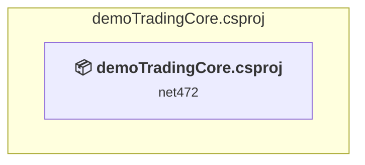

### API Compatibility

| Category | Count | Impact |
| :--- | :---: | :--- |
| 🔴 Binary Incompatible | 0 | High - Require code changes |
| 🟡 Source Incompatible | 0 | Medium - Needs re-compilation and potential conflicting API error fixing |
| 🔵 Behavioral change | 0 | Low - Behavioral changes that may require testing at runtime |
| ✅ Compatible | 2037 |  |
| ***Total APIs Analyzed*** | ***2037*** |  |

<a id="visualhftcommonswpfvisualhftcommonswpfcsproj"></a>
### VisualHFT.Commons.WPF\VisualHFT.Commons.WPF.csproj

#### Project Info

- **Current Target Framework:** net8.0-windows
- **Proposed Target Framework:** net10.0-windows
- **SDK-style**: True
- **Project Kind:** Wpf
- **Dependencies**: 1
- **Dependants**: 5
- **Number of Files**: 3
- **Number of Files with Incidents**: 3
- **Lines of Code**: 312
- **Estimated LOC to modify**: 54+ (at least 17.3% of the project)

#### Dependency Graph

Legend:
📦 SDK-style project
⚙️ Classic project

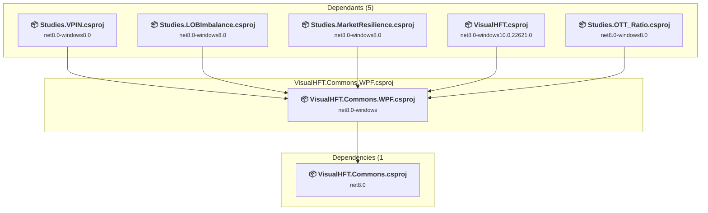

### API Compatibility

| Category | Count | Impact |
| :--- | :---: | :--- |
| 🔴 Binary Incompatible | 51 | High - Require code changes |
| 🟡 Source Incompatible | 3 | Medium - Needs re-compilation and potential conflicting API error fixing |
| 🔵 Behavioral change | 0 | Low - Behavioral changes that may require testing at runtime |
| ✅ Compatible | 279 |  |
| ***Total APIs Analyzed*** | ***333*** |  |

#### Project Technologies and Features

| Technology | Issues | Percentage | Migration Path |
| :--- | :---: | :---: | :--- |
| WPF (Windows Presentation Foundation) | 39 | 72.2% | WPF APIs for building Windows desktop applications with XAML-based UI that are available in .NET on Windows. WPF provides rich desktop UI capabilities with data binding and styling. Enable Windows Desktop support: Option 1 (Recommended): Target net9.0-windows; Option 2: Add <UseWindowsDesktop>true</UseWindowsDesktop>. |

<a id="visualhftcommonsvisualhftcommonscsproj"></a>
### VisualHFT.Commons\VisualHFT.Commons.csproj

#### Project Info

- **Current Target Framework:** net8.0
- **Proposed Target Framework:** net10.0
- **SDK-style**: True
- **Project Kind:** ClassLibrary
- **Dependencies**: 0
- **Dependants**: 16
- **Number of Files**: 64
- **Number of Files with Incidents**: 5
- **Lines of Code**: 8628
- **Estimated LOC to modify**: 98+ (at least 1.1% of the project)

#### Dependency Graph

Legend:
📦 SDK-style project
⚙️ Classic project

```mermaid
flowchart TB
    subgraph upstream["Dependants (16)"]
        P3["<b>📦&nbsp;MarketConnectors.Binance.csproj</b><br/><small>net8.0-windows8.0</small>"]
        P4["<b>📦&nbsp;MarketConnectors.Bitfinex.csproj</b><br/><small>net8.0-windows8.0</small>"]
        P5["<b>📦&nbsp;MarketConnectors.WebSocket.csproj</b><br/><small>net8.0-windows8.0</small>"]
        P6["<b>📦&nbsp;Studies.VPIN.csproj</b><br/><small>net8.0-windows8.0</small>"]
        P7["<b>📦&nbsp;VisualHFT.Commons.WPF.csproj</b><br/><small>net8.0-windows</small>"]
        P8["<b>📦&nbsp;Studies.LOBImbalance.csproj</b><br/><small>net8.0-windows8.0</small>"]
        P9["<b>📦&nbsp;Studies.MarketResilience.csproj</b><br/><small>net8.0-windows8.0</small>"]
        P10["<b>📦&nbsp;VisualHFT.csproj</b><br/><small>net8.0-windows10.0.22621.0</small>"]
        P11["<b>📦&nbsp;MarketConnectors.BitStamp.csproj</b><br/><small>net8.0-windows</small>"]
        P12["<b>📦&nbsp;MarketConnectors.Coinbase.csproj</b><br/><small>net8.0-windows</small>"]
        P13["<b>📦&nbsp;MarketConnectors.Gemini.csproj</b><br/><small>net8.0-windows</small>"]
        P14["<b>📦&nbsp;MarketConnectors.Kraken.csproj</b><br/><small>net8.0-windows8.0</small>"]
        P15["<b>📦&nbsp;MarketConnectors.KuCoin.csproj</b><br/><small>net8.0-windows8.0</small>"]
        P18["<b>📦&nbsp;VisualHFT.DataRetriever.TestingFramework.csproj</b><br/><small>net8.0-windows8.0</small>"]
        P19["<b>📦&nbsp;Studies.MarketResilience.Test.csproj</b><br/><small>net8.0-windows8.0</small>"]
        P25["<b>📦&nbsp;Studies.OTT_Ratio.csproj</b><br/><small>net8.0-windows8.0</small>"]
        click P3 "#visualhftpluginsmarketconnectorsbinancemarketconnectorsbinancecsproj"
        click P4 "#visualhftpluginsmarketconnectorsbitfinexmarketconnectorsbitfinexcsproj"
        click P5 "#visualhftpluginsmarketconnectorswebsocketmarketconnectorswebsocketcsproj"
        click P6 "#visualhftpluginsstudiesvpinstudiesvpincsproj"
        click P7 "#visualhftcommonswpfvisualhftcommonswpfcsproj"
        click P8 "#visualhftpluginsstudieslobimbalancestudieslobimbalancecsproj"
        click P9 "#visualhftpluginsstudiesmarketresiliencestudiesmarketresiliencecsproj"
        click P10 "#visualhftcsproj"
        click P11 "#visualhftpluginsmarketconnectorsbitstampmarketconnectorsbitstampcsproj"
        click P12 "#visualhftpluginsmarketconnectorscoinbasemarketconnectorscoinbasecsproj"
        click P13 "#visualhftpluginsmarketconnectorsgeminimarketconnectorsgeminimarketconnectorsgeminicsproj"
        click P14 "#visualhftpluginsmarketconnectorskrakenmarketconnectorskrakencsproj"
        click P15 "#visualhftpluginsmarketconnectorskucoinmarketconnectorskucoincsproj"
        click P18 "#visualhftdataretrievertestingframeworkvisualhftdataretrievertestingframeworkcsproj"
        click P19 "#visualhftpluginsstudiesmarketresilienceteststudiesmarketresiliencetestcsproj"
        click P25 "#visualhftpluginsstudiesott_ratiostudiesott_ratiocsproj"
    end
    subgraph current["VisualHFT.Commons.csproj"]
        MAIN["<b>📦&nbsp;VisualHFT.Commons.csproj</b><br/><small>net8.0</small>"]
        click MAIN "#visualhftcommonsvisualhftcommonscsproj"
    end
    P3 --> MAIN
    P4 --> MAIN
    P5 --> MAIN
    P6 --> MAIN
    P7 --> MAIN
    P8 --> MAIN
    P9 --> MAIN
    P10 --> MAIN
    P11 --> MAIN
    P12 --> MAIN
    P13 --> MAIN
    P14 --> MAIN
    P15 --> MAIN
    P18 --> MAIN
    P19 --> MAIN
    P25 --> MAIN

```

### API Compatibility

| Category | Count | Impact |
| :--- | :---: | :--- |
| 🔴 Binary Incompatible | 0 | High - Require code changes |
| 🟡 Source Incompatible | 98 | Medium - Needs re-compilation and potential conflicting API error fixing |
| 🔵 Behavioral change | 0 | Low - Behavioral changes that may require testing at runtime |
| ✅ Compatible | 7325 |  |
| ***Total APIs Analyzed*** | ***7423*** |  |

<a id="visualhftcsproj"></a>
### VisualHFT.csproj

#### Project Info

- **Current Target Framework:** net8.0-windows10.0.22621.0
- **Proposed Target Framework:** net10.0-windows
- **SDK-style**: True
- **Project Kind:** Wpf
- **Dependencies**: 15
- **Dependants**: 1
- **Number of Files**: 143
- **Number of Files with Incidents**: 107
- **Lines of Code**: 11400
- **Estimated LOC to modify**: 2114+ (at least 18.5% of the project)

#### Dependency Graph

Legend:
📦 SDK-style project
⚙️ Classic project

```mermaid
flowchart TB
    subgraph upstream["Dependants (1)"]
        P20["<b>📦&nbsp;VisualHFT.TriggerService.TestingFramework.csproj</b><br/><small>net8.0-windows10.0.22621.0</small>"]
        click P20 "#visualhfttriggerservicetestingframeworkvisualhfttriggerservicetestingframeworkcsproj"
    end
    subgraph current["VisualHFT.csproj"]
        MAIN["<b>📦&nbsp;VisualHFT.csproj</b><br/><small>net8.0-windows10.0.22621.0</small>"]
        click MAIN "#visualhftcsproj"
    end
    subgraph downstream["Dependencies (15"]
        P14["<b>📦&nbsp;MarketConnectors.Kraken.csproj</b><br/><small>net8.0-windows8.0</small>"]
        P3["<b>📦&nbsp;MarketConnectors.Binance.csproj</b><br/><small>net8.0-windows8.0</small>"]
        P11["<b>📦&nbsp;MarketConnectors.BitStamp.csproj</b><br/><small>net8.0-windows</small>"]
        P7["<b>📦&nbsp;VisualHFT.Commons.WPF.csproj</b><br/><small>net8.0-windows</small>"]
        P12["<b>📦&nbsp;MarketConnectors.Coinbase.csproj</b><br/><small>net8.0-windows</small>"]
        P6["<b>📦&nbsp;Studies.VPIN.csproj</b><br/><small>net8.0-windows8.0</small>"]
        P21["<b>📦&nbsp;OxyPlot.csproj</b><br/><small>net8.0-windows8.0</small>"]
        P22["<b>📦&nbsp;OxyPlot.SkiaSharp.Wpf.csproj</b><br/><small>net8.0-windows10.0.17763.0</small>"]
        P8["<b>📦&nbsp;Studies.LOBImbalance.csproj</b><br/><small>net8.0-windows8.0</small>"]
        P2["<b>📦&nbsp;VisualHFT.Commons.csproj</b><br/><small>net8.0</small>"]
        P25["<b>📦&nbsp;Studies.OTT_Ratio.csproj</b><br/><small>net8.0-windows8.0</small>"]
        P9["<b>📦&nbsp;Studies.MarketResilience.csproj</b><br/><small>net8.0-windows8.0</small>"]
        P15["<b>📦&nbsp;MarketConnectors.KuCoin.csproj</b><br/><small>net8.0-windows8.0</small>"]
        P4["<b>📦&nbsp;MarketConnectors.Bitfinex.csproj</b><br/><small>net8.0-windows8.0</small>"]
        P13["<b>📦&nbsp;MarketConnectors.Gemini.csproj</b><br/><small>net8.0-windows</small>"]
        click P14 "#visualhftpluginsmarketconnectorskrakenmarketconnectorskrakencsproj"
        click P3 "#visualhftpluginsmarketconnectorsbinancemarketconnectorsbinancecsproj"
        click P11 "#visualhftpluginsmarketconnectorsbitstampmarketconnectorsbitstampcsproj"
        click P7 "#visualhftcommonswpfvisualhftcommonswpfcsproj"
        click P12 "#visualhftpluginsmarketconnectorscoinbasemarketconnectorscoinbasecsproj"
        click P6 "#visualhftpluginsstudiesvpinstudiesvpincsproj"
        click P21 "#c:myfilesdevelopmentoxyplotsourceoxyplotoxyplotcsproj"
        click P22 "#c:myfilesdevelopmentoxyplotsourceoxyplotskiasharpwpfoxyplotskiasharpwpfcsproj"
        click P8 "#visualhftpluginsstudieslobimbalancestudieslobimbalancecsproj"
        click P2 "#visualhftcommonsvisualhftcommonscsproj"
        click P25 "#visualhftpluginsstudiesott_ratiostudiesott_ratiocsproj"
        click P9 "#visualhftpluginsstudiesmarketresiliencestudiesmarketresiliencecsproj"
        click P15 "#visualhftpluginsmarketconnectorskucoinmarketconnectorskucoincsproj"
        click P4 "#visualhftpluginsmarketconnectorsbitfinexmarketconnectorsbitfinexcsproj"
        click P13 "#visualhftpluginsmarketconnectorsgeminimarketconnectorsgeminimarketconnectorsgeminicsproj"
    end
    P20 --> MAIN
    MAIN --> P14
    MAIN --> P3
    MAIN --> P11
    MAIN --> P7
    MAIN --> P12
    MAIN --> P6
    MAIN --> P21
    MAIN --> P22
    MAIN --> P8
    MAIN --> P2
    MAIN --> P25
    MAIN --> P9
    MAIN --> P15
    MAIN --> P4
    MAIN --> P13

```

### API Compatibility

| Category | Count | Impact |
| :--- | :---: | :--- |
| 🔴 Binary Incompatible | 2031 | High - Require code changes |
| 🟡 Source Incompatible | 10 | Medium - Needs re-compilation and potential conflicting API error fixing |
| 🔵 Behavioral change | 73 | Low - Behavioral changes that may require testing at runtime |
| ✅ Compatible | 9454 |  |
| ***Total APIs Analyzed*** | ***11568*** |  |

#### Project Technologies and Features

| Technology | Issues | Percentage | Migration Path |
| :--- | :---: | :---: | :--- |
| Printing & XAML Infrastructure | 45 | 2.1% | WPF printing subsystem and XAML services that are Windows-specific and have limited cross-platform support. These APIs are specific to Windows printing infrastructure. Use Windows Compatibility Pack or redesign for cross-platform scenarios. |
| WPF (Windows Presentation Foundation) | 924 | 43.7% | WPF APIs for building Windows desktop applications with XAML-based UI that are available in .NET on Windows. WPF provides rich desktop UI capabilities with data binding and styling. Enable Windows Desktop support: Option 1 (Recommended): Target net9.0-windows; Option 2: Add <UseWindowsDesktop>true</UseWindowsDesktop>. |

<a id="visualhftdataretrievertestingframeworkvisualhftdataretrievertestingframeworkcsproj"></a>
### VisualHFT.DataRetriever.TestingFramework\VisualHFT.DataRetriever.TestingFramework.csproj

#### Project Info

- **Current Target Framework:** net8.0-windows8.0
- **Proposed Target Framework:** net10.0--windows8.0
- **SDK-style**: True
- **Project Kind:** DotNetCoreApp
- **Dependencies**: 8
- **Dependants**: 0
- **Number of Files**: 18
- **Number of Files with Incidents**: 5
- **Lines of Code**: 4917
- **Estimated LOC to modify**: 34+ (at least 0.7% of the project)

#### Dependency Graph

Legend:
📦 SDK-style project
⚙️ Classic project

```mermaid
flowchart TB
    subgraph current["VisualHFT.DataRetriever.TestingFramework.csproj"]
        MAIN["<b>📦&nbsp;VisualHFT.DataRetriever.TestingFramework.csproj</b><br/><small>net8.0-windows8.0</small>"]
        click MAIN "#visualhftdataretrievertestingframeworkvisualhftdataretrievertestingframeworkcsproj"
    end
    subgraph downstream["Dependencies (8"]
        P4["<b>📦&nbsp;MarketConnectors.Bitfinex.csproj</b><br/><small>net8.0-windows8.0</small>"]
        P3["<b>📦&nbsp;MarketConnectors.Binance.csproj</b><br/><small>net8.0-windows8.0</small>"]
        P12["<b>📦&nbsp;MarketConnectors.Coinbase.csproj</b><br/><small>net8.0-windows</small>"]
        P15["<b>📦&nbsp;MarketConnectors.KuCoin.csproj</b><br/><small>net8.0-windows8.0</small>"]
        P13["<b>📦&nbsp;MarketConnectors.Gemini.csproj</b><br/><small>net8.0-windows</small>"]
        P11["<b>📦&nbsp;MarketConnectors.BitStamp.csproj</b><br/><small>net8.0-windows</small>"]
        P14["<b>📦&nbsp;MarketConnectors.Kraken.csproj</b><br/><small>net8.0-windows8.0</small>"]
        P2["<b>📦&nbsp;VisualHFT.Commons.csproj</b><br/><small>net8.0</small>"]
        click P4 "#visualhftpluginsmarketconnectorsbitfinexmarketconnectorsbitfinexcsproj"
        click P3 "#visualhftpluginsmarketconnectorsbinancemarketconnectorsbinancecsproj"
        click P12 "#visualhftpluginsmarketconnectorscoinbasemarketconnectorscoinbasecsproj"
        click P15 "#visualhftpluginsmarketconnectorskucoinmarketconnectorskucoincsproj"
        click P13 "#visualhftpluginsmarketconnectorsgeminimarketconnectorsgeminimarketconnectorsgeminicsproj"
        click P11 "#visualhftpluginsmarketconnectorsbitstampmarketconnectorsbitstampcsproj"
        click P14 "#visualhftpluginsmarketconnectorskrakenmarketconnectorskrakencsproj"
        click P2 "#visualhftcommonsvisualhftcommonscsproj"
    end
    MAIN --> P4
    MAIN --> P3
    MAIN --> P12
    MAIN --> P15
    MAIN --> P13
    MAIN --> P11
    MAIN --> P14
    MAIN --> P2

```

### API Compatibility

| Category | Count | Impact |
| :--- | :---: | :--- |
| 🔴 Binary Incompatible | 0 | High - Require code changes |
| 🟡 Source Incompatible | 34 | Medium - Needs re-compilation and potential conflicting API error fixing |
| 🔵 Behavioral change | 0 | Low - Behavioral changes that may require testing at runtime |
| ✅ Compatible | 6107 |  |
| ***Total APIs Analyzed*** | ***6141*** |  |

<a id="visualhftpluginsmarketconnectorsbasedalbitstampnetbitstampnetcsproj"></a>
### VisualHFT.Plugins\MarketConnectors.BaseDAL\BitStamp.Net\BitStamp.Net.csproj

#### Project Info

- **Current Target Framework:** net8.0
- **Proposed Target Framework:** net10.0
- **SDK-style**: True
- **Project Kind:** ClassLibrary
- **Dependencies**: 0
- **Dependants**: 1
- **Number of Files**: 2
- **Number of Files with Incidents**: 2
- **Lines of Code**: 126
- **Estimated LOC to modify**: 7+ (at least 5.6% of the project)

#### Dependency Graph

Legend:
📦 SDK-style project
⚙️ Classic project

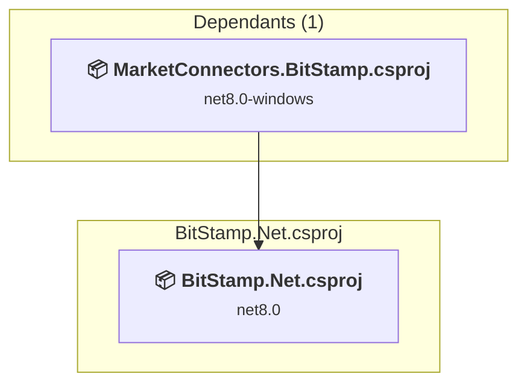

### API Compatibility

| Category | Count | Impact |
| :--- | :---: | :--- |
| 🔴 Binary Incompatible | 0 | High - Require code changes |
| 🟡 Source Incompatible | 0 | Medium - Needs re-compilation and potential conflicting API error fixing |
| 🔵 Behavioral change | 7 | Low - Behavioral changes that may require testing at runtime |
| ✅ Compatible | 131 |  |
| ***Total APIs Analyzed*** | ***138*** |  |

<a id="visualhftpluginsmarketconnectorsbasedalgemininetgemininetcsproj"></a>
### VisualHFT.Plugins\MarketConnectors.BaseDAL\Gemini.Net\Gemini.Net.csproj

#### Project Info

- **Current Target Framework:** net8.0
- **Proposed Target Framework:** net10.0
- **SDK-style**: True
- **Project Kind:** ClassLibrary
- **Dependencies**: 0
- **Dependants**: 1
- **Number of Files**: 3
- **Number of Files with Incidents**: 3
- **Lines of Code**: 215
- **Estimated LOC to modify**: 13+ (at least 6.0% of the project)

#### Dependency Graph

Legend:
📦 SDK-style project
⚙️ Classic project

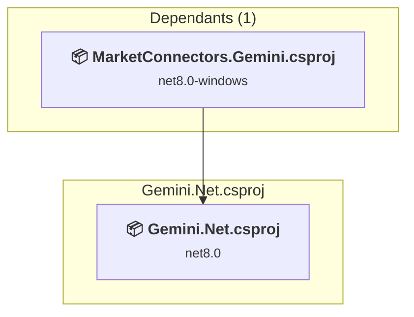

### API Compatibility

| Category | Count | Impact |
| :--- | :---: | :--- |
| 🔴 Binary Incompatible | 0 | High - Require code changes |
| 🟡 Source Incompatible | 2 | Medium - Needs re-compilation and potential conflicting API error fixing |
| 🔵 Behavioral change | 11 | Low - Behavioral changes that may require testing at runtime |
| ✅ Compatible | 298 |  |
| ***Total APIs Analyzed*** | ***311*** |  |

<a id="visualhftpluginsmarketconnectorsbinancemarketconnectorsbinancecsproj"></a>
### VisualHFT.Plugins\MarketConnectors.Binance\MarketConnectors.Binance.csproj

#### Project Info

- **Current Target Framework:** net8.0-windows8.0
- **Proposed Target Framework:** net10.0-windows
- **SDK-style**: True
- **Project Kind:** Wpf
- **Dependencies**: 1
- **Dependants**: 2
- **Number of Files**: 14
- **Number of Files with Incidents**: 5
- **Lines of Code**: 1461
- **Estimated LOC to modify**: 27+ (at least 1.8% of the project)

#### Dependency Graph

Legend:
📦 SDK-style project
⚙️ Classic project

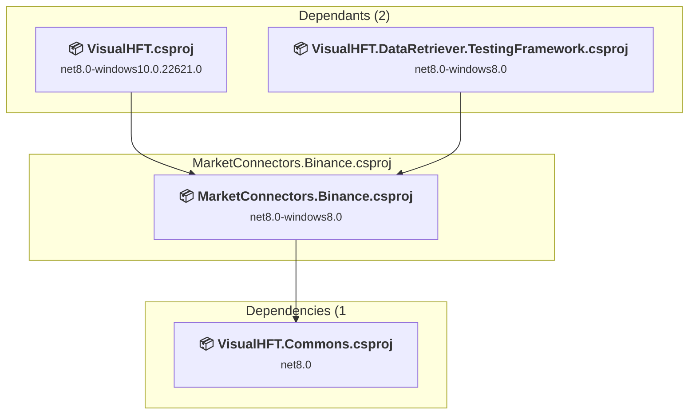

### API Compatibility

| Category | Count | Impact |
| :--- | :---: | :--- |
| 🔴 Binary Incompatible | 21 | High - Require code changes |
| 🟡 Source Incompatible | 0 | Medium - Needs re-compilation and potential conflicting API error fixing |
| 🔵 Behavioral change | 6 | Low - Behavioral changes that may require testing at runtime |
| ✅ Compatible | 1899 |  |
| ***Total APIs Analyzed*** | ***1926*** |  |

#### Project Technologies and Features

| Technology | Issues | Percentage | Migration Path |
| :--- | :---: | :---: | :--- |
| WPF (Windows Presentation Foundation) | 16 | 59.3% | WPF APIs for building Windows desktop applications with XAML-based UI that are available in .NET on Windows. WPF provides rich desktop UI capabilities with data binding and styling. Enable Windows Desktop support: Option 1 (Recommended): Target net9.0-windows; Option 2: Add <UseWindowsDesktop>true</UseWindowsDesktop>. |

<a id="visualhftpluginsmarketconnectorsbitfinexmarketconnectorsbitfinexcsproj"></a>
### VisualHFT.Plugins\MarketConnectors.Bitfinex\MarketConnectors.Bitfinex.csproj

#### Project Info

- **Current Target Framework:** net8.0-windows8.0
- **Proposed Target Framework:** net10.0-windows
- **SDK-style**: True
- **Project Kind:** Wpf
- **Dependencies**: 1
- **Dependants**: 2
- **Number of Files**: 15
- **Number of Files with Incidents**: 4
- **Lines of Code**: 1529
- **Estimated LOC to modify**: 25+ (at least 1.6% of the project)

#### Dependency Graph

Legend:
📦 SDK-style project
⚙️ Classic project

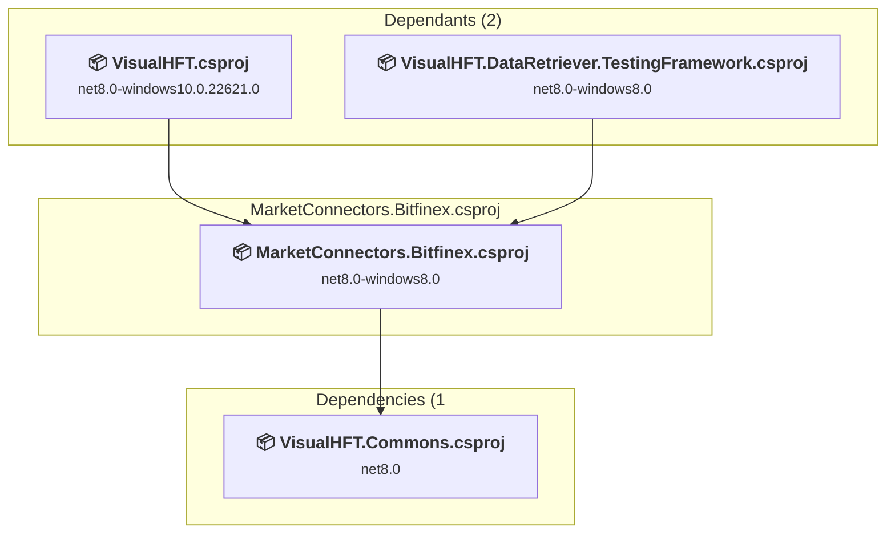

### API Compatibility

| Category | Count | Impact |
| :--- | :---: | :--- |
| 🔴 Binary Incompatible | 21 | High - Require code changes |
| 🟡 Source Incompatible | 0 | Medium - Needs re-compilation and potential conflicting API error fixing |
| 🔵 Behavioral change | 4 | Low - Behavioral changes that may require testing at runtime |
| ✅ Compatible | 1991 |  |
| ***Total APIs Analyzed*** | ***2016*** |  |

#### Project Technologies and Features

| Technology | Issues | Percentage | Migration Path |
| :--- | :---: | :---: | :--- |
| WPF (Windows Presentation Foundation) | 16 | 64.0% | WPF APIs for building Windows desktop applications with XAML-based UI that are available in .NET on Windows. WPF provides rich desktop UI capabilities with data binding and styling. Enable Windows Desktop support: Option 1 (Recommended): Target net9.0-windows; Option 2: Add <UseWindowsDesktop>true</UseWindowsDesktop>. |

<a id="visualhftpluginsmarketconnectorsbitstampmarketconnectorsbitstampcsproj"></a>
### VisualHFT.Plugins\MarketConnectors.BitStamp\MarketConnectors.BitStamp.csproj

#### Project Info

- **Current Target Framework:** net8.0-windows
- **Proposed Target Framework:** net10.0-windows
- **SDK-style**: True
- **Project Kind:** Wpf
- **Dependencies**: 2
- **Dependants**: 2
- **Number of Files**: 6
- **Number of Files with Incidents**: 4
- **Lines of Code**: 872
- **Estimated LOC to modify**: 30+ (at least 3.4% of the project)

#### Dependency Graph

Legend:
📦 SDK-style project
⚙️ Classic project

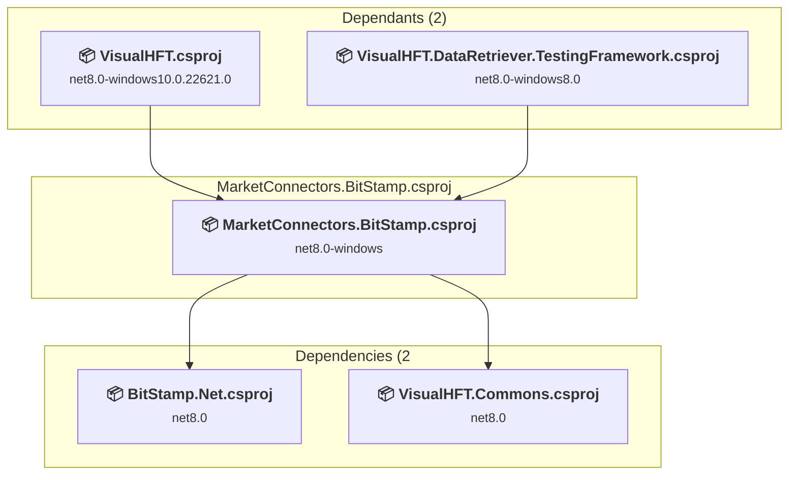

### API Compatibility

| Category | Count | Impact |
| :--- | :---: | :--- |
| 🔴 Binary Incompatible | 21 | High - Require code changes |
| 🟡 Source Incompatible | 3 | Medium - Needs re-compilation and potential conflicting API error fixing |
| 🔵 Behavioral change | 6 | Low - Behavioral changes that may require testing at runtime |
| ✅ Compatible | 881 |  |
| ***Total APIs Analyzed*** | ***911*** |  |

#### Project Technologies and Features

| Technology | Issues | Percentage | Migration Path |
| :--- | :---: | :---: | :--- |
| WPF (Windows Presentation Foundation) | 16 | 53.3% | WPF APIs for building Windows desktop applications with XAML-based UI that are available in .NET on Windows. WPF provides rich desktop UI capabilities with data binding and styling. Enable Windows Desktop support: Option 1 (Recommended): Target net9.0-windows; Option 2: Add <UseWindowsDesktop>true</UseWindowsDesktop>. |

<a id="visualhftpluginsmarketconnectorscoinbasemarketconnectorscoinbasecsproj"></a>
### VisualHFT.Plugins\MarketConnectors.Coinbase\MarketConnectors.Coinbase.csproj

#### Project Info

- **Current Target Framework:** net8.0-windows
- **Proposed Target Framework:** net10.0-windows
- **SDK-style**: True
- **Project Kind:** Wpf
- **Dependencies**: 1
- **Dependants**: 2
- **Number of Files**: 5
- **Number of Files with Incidents**: 4
- **Lines of Code**: 1233
- **Estimated LOC to modify**: 25+ (at least 2.0% of the project)

#### Dependency Graph

Legend:
📦 SDK-style project
⚙️ Classic project

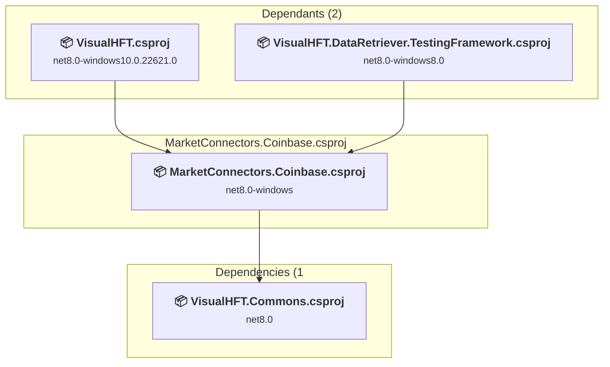

### API Compatibility

| Category | Count | Impact |
| :--- | :---: | :--- |
| 🔴 Binary Incompatible | 21 | High - Require code changes |
| 🟡 Source Incompatible | 0 | Medium - Needs re-compilation and potential conflicting API error fixing |
| 🔵 Behavioral change | 4 | Low - Behavioral changes that may require testing at runtime |
| ✅ Compatible | 1419 |  |
| ***Total APIs Analyzed*** | ***1444*** |  |

#### Project Technologies and Features

| Technology | Issues | Percentage | Migration Path |
| :--- | :---: | :---: | :--- |
| WPF (Windows Presentation Foundation) | 16 | 64.0% | WPF APIs for building Windows desktop applications with XAML-based UI that are available in .NET on Windows. WPF provides rich desktop UI capabilities with data binding and styling. Enable Windows Desktop support: Option 1 (Recommended): Target net9.0-windows; Option 2: Add <UseWindowsDesktop>true</UseWindowsDesktop>. |

<a id="visualhftpluginsmarketconnectorsgeminimarketconnectorsgeminimarketconnectorsgeminicsproj"></a>
### VisualHFT.Plugins\MarketConnectors.Gemini\MarketConnectors.Gemini\MarketConnectors.Gemini.csproj

#### Project Info

- **Current Target Framework:** net8.0-windows
- **Proposed Target Framework:** net10.0-windows
- **SDK-style**: True
- **Project Kind:** Wpf
- **Dependencies**: 2
- **Dependants**: 2
- **Number of Files**: 18
- **Number of Files with Incidents**: 4
- **Lines of Code**: 1470
- **Estimated LOC to modify**: 33+ (at least 2.2% of the project)

#### Dependency Graph

Legend:
📦 SDK-style project
⚙️ Classic project

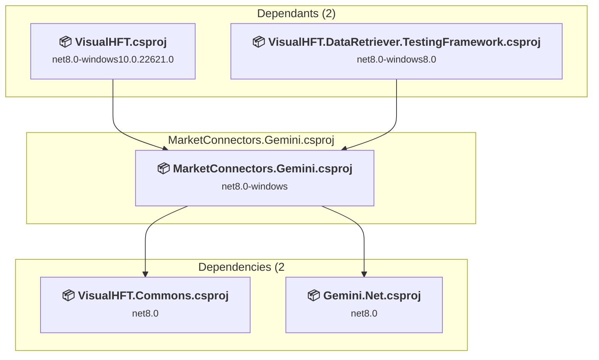

### API Compatibility

| Category | Count | Impact |
| :--- | :---: | :--- |
| 🔴 Binary Incompatible | 21 | High - Require code changes |
| 🟡 Source Incompatible | 4 | Medium - Needs re-compilation and potential conflicting API error fixing |
| 🔵 Behavioral change | 8 | Low - Behavioral changes that may require testing at runtime |
| ✅ Compatible | 1426 |  |
| ***Total APIs Analyzed*** | ***1459*** |  |

#### Project Technologies and Features

| Technology | Issues | Percentage | Migration Path |
| :--- | :---: | :---: | :--- |
| WPF (Windows Presentation Foundation) | 16 | 48.5% | WPF APIs for building Windows desktop applications with XAML-based UI that are available in .NET on Windows. WPF provides rich desktop UI capabilities with data binding and styling. Enable Windows Desktop support: Option 1 (Recommended): Target net9.0-windows; Option 2: Add <UseWindowsDesktop>true</UseWindowsDesktop>. |

<a id="visualhftpluginsmarketconnectorskrakenmarketconnectorskrakencsproj"></a>
### VisualHFT.Plugins\MarketConnectors.Kraken\MarketConnectors.Kraken.csproj

#### Project Info

- **Current Target Framework:** net8.0-windows8.0
- **Proposed Target Framework:** net10.0-windows
- **SDK-style**: True
- **Project Kind:** Wpf
- **Dependencies**: 1
- **Dependants**: 2
- **Number of Files**: 15
- **Number of Files with Incidents**: 5
- **Lines of Code**: 1654
- **Estimated LOC to modify**: 27+ (at least 1.6% of the project)

#### Dependency Graph

Legend:
📦 SDK-style project
⚙️ Classic project


### API Compatibility

| Category | Count | Impact |
| :--- | :---: | :--- |
| 🔴 Binary Incompatible | 21 | High - Require code changes |
| 🟡 Source Incompatible | 0 | Medium - Needs re-compilation and potential conflicting API error fixing |
| 🔵 Behavioral change | 6 | Low - Behavioral changes that may require testing at runtime |
| ✅ Compatible | 2190 |  |
| ***Total APIs Analyzed*** | ***2217*** |  |

#### Project Technologies and Features

| Technology | Issues | Percentage | Migration Path |
| :--- | :---: | :---: | :--- |
| WPF (Windows Presentation Foundation) | 16 | 59.3% | WPF APIs for building Windows desktop applications with XAML-based UI that are available in .NET on Windows. WPF provides rich desktop UI capabilities with data binding and styling. Enable Windows Desktop support: Option 1 (Recommended): Target net9.0-windows; Option 2: Add <UseWindowsDesktop>true</UseWindowsDesktop>. |

<a id="visualhftpluginsmarketconnectorskucoinmarketconnectorskucoincsproj"></a>
### VisualHFT.Plugins\MarketConnectors.KuCoin\MarketConnectors.KuCoin.csproj

#### Project Info

- **Current Target Framework:** net8.0-windows8.0
- **Proposed Target Framework:** net10.0-windows
- **SDK-style**: True
- **Project Kind:** Wpf
- **Dependencies**: 1
- **Dependants**: 2
- **Number of Files**: 14
- **Number of Files with Incidents**: 5
- **Lines of Code**: 1805
- **Estimated LOC to modify**: 30+ (at least 1.7% of the project)

#### Dependency Graph

Legend:
📦 SDK-style project
⚙️ Classic project

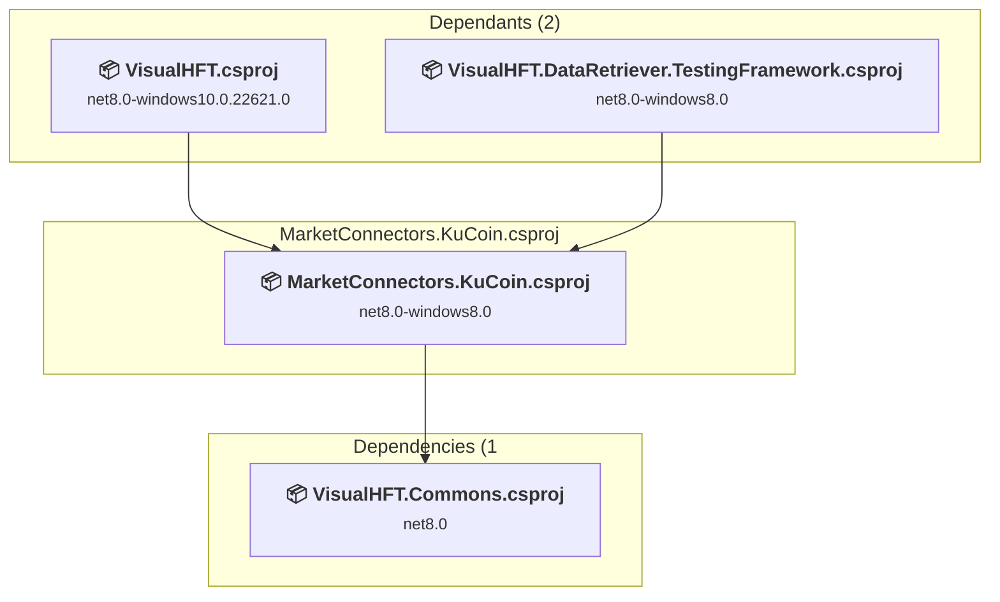

### API Compatibility

| Category | Count | Impact |
| :--- | :---: | :--- |
| 🔴 Binary Incompatible | 21 | High - Require code changes |
| 🟡 Source Incompatible | 3 | Medium - Needs re-compilation and potential conflicting API error fixing |
| 🔵 Behavioral change | 6 | Low - Behavioral changes that may require testing at runtime |
| ✅ Compatible | 2332 |  |
| ***Total APIs Analyzed*** | ***2362*** |  |

#### Project Technologies and Features

| Technology | Issues | Percentage | Migration Path |
| :--- | :---: | :---: | :--- |
| WPF (Windows Presentation Foundation) | 16 | 53.3% | WPF APIs for building Windows desktop applications with XAML-based UI that are available in .NET on Windows. WPF provides rich desktop UI capabilities with data binding and styling. Enable Windows Desktop support: Option 1 (Recommended): Target net9.0-windows; Option 2: Add <UseWindowsDesktop>true</UseWindowsDesktop>. |

<a id="visualhftpluginsmarketconnectorswebsocketmarketconnectorswebsocketcsproj"></a>
### VisualHFT.Plugins\MarketConnectors.WebSocket\MarketConnectors.WebSocket.csproj

#### Project Info

- **Current Target Framework:** net8.0-windows8.0
- **Proposed Target Framework:** net10.0-windows
- **SDK-style**: True
- **Project Kind:** Wpf
- **Dependencies**: 1
- **Dependants**: 0
- **Number of Files**: 6
- **Number of Files with Incidents**: 4
- **Lines of Code**: 517
- **Estimated LOC to modify**: 12+ (at least 2.3% of the project)

#### Dependency Graph

Legend:
📦 SDK-style project
⚙️ Classic project

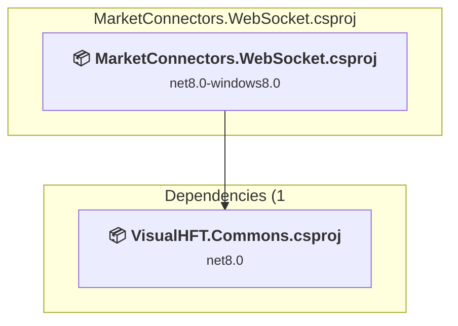

### API Compatibility

| Category | Count | Impact |
| :--- | :---: | :--- |
| 🔴 Binary Incompatible | 7 | High - Require code changes |
| 🟡 Source Incompatible | 2 | Medium - Needs re-compilation and potential conflicting API error fixing |
| 🔵 Behavioral change | 3 | Low - Behavioral changes that may require testing at runtime |
| ✅ Compatible | 512 |  |
| ***Total APIs Analyzed*** | ***524*** |  |

#### Project Technologies and Features

| Technology | Issues | Percentage | Migration Path |
| :--- | :---: | :---: | :--- |
| WPF (Windows Presentation Foundation) | 4 | 33.3% | WPF APIs for building Windows desktop applications with XAML-based UI that are available in .NET on Windows. WPF provides rich desktop UI capabilities with data binding and styling. Enable Windows Desktop support: Option 1 (Recommended): Target net9.0-windows; Option 2: Add <UseWindowsDesktop>true</UseWindowsDesktop>. |

<a id="visualhftpluginsstudieslobimbalancestudieslobimbalancecsproj"></a>
### VisualHFT.Plugins\Studies.LOBImbalance\Studies.LOBImbalance.csproj

#### Project Info

- **Current Target Framework:** net8.0-windows8.0
- **Proposed Target Framework:** net10.0-windows
- **SDK-style**: True
- **Project Kind:** Wpf
- **Dependencies**: 2
- **Dependants**: 1
- **Number of Files**: 4
- **Number of Files with Incidents**: 5
- **Lines of Code**: 420
- **Estimated LOC to modify**: 19+ (at least 4.5% of the project)

#### Dependency Graph

Legend:
📦 SDK-style project
⚙️ Classic project

```mermaid
flowchart TB
    subgraph upstream["Dependants (1)"]
        P10["<b>📦&nbsp;VisualHFT.csproj</b><br/><small>net8.0-windows10.0.22621.0</small>"]
        click P10 "#visualhftcsproj"
    end
    subgraph current["Studies.LOBImbalance.csproj"]
        MAIN["<b>📦&nbsp;Studies.LOBImbalance.csproj</b><br/><small>net8.0-windows8.0</small>"]
        click MAIN "#visualhftpluginsstudieslobimbalancestudieslobimbalancecsproj"
    end
    subgraph downstream["Dependencies (2"]
        P7["<b>📦&nbsp;VisualHFT.Commons.WPF.csproj</b><br/><small>net8.0-windows</small>"]
        P2["<b>📦&nbsp;VisualHFT.Commons.csproj</b><br/><small>net8.0</small>"]
        click P7 "#visualhftcommonswpfvisualhftcommonswpfcsproj"
        click P2 "#visualhftcommonsvisualhftcommonscsproj"
    end
    P10 --> MAIN
    MAIN --> P7
    MAIN --> P2

```

### API Compatibility

| Category | Count | Impact |
| :--- | :---: | :--- |
| 🔴 Binary Incompatible | 17 | High - Require code changes |
| 🟡 Source Incompatible | 0 | Medium - Needs re-compilation and potential conflicting API error fixing |
| 🔵 Behavioral change | 2 | Low - Behavioral changes that may require testing at runtime |
| ✅ Compatible | 369 |  |
| ***Total APIs Analyzed*** | ***388*** |  |

#### Project Technologies and Features

| Technology | Issues | Percentage | Migration Path |
| :--- | :---: | :---: | :--- |
| WPF (Windows Presentation Foundation) | 11 | 57.9% | WPF APIs for building Windows desktop applications with XAML-based UI that are available in .NET on Windows. WPF provides rich desktop UI capabilities with data binding and styling. Enable Windows Desktop support: Option 1 (Recommended): Target net9.0-windows; Option 2: Add <UseWindowsDesktop>true</UseWindowsDesktop>. |

<a id="visualhftpluginsstudiesmarketresilienceteststudiesmarketresiliencetestcsproj"></a>
### VisualHFT.Plugins\Studies.MarketResilience.Test\Studies.MarketResilience.Test.csproj

#### Project Info

- **Current Target Framework:** net8.0-windows8.0
- **Proposed Target Framework:** net10.0--windows8.0
- **SDK-style**: True
- **Project Kind:** DotNetCoreApp
- **Dependencies**: 2
- **Dependants**: 0
- **Number of Files**: 5
- **Number of Files with Incidents**: 1
- **Lines of Code**: 2267
- **Estimated LOC to modify**: 0+ (at least 0.0% of the project)

#### Dependency Graph

Legend:
📦 SDK-style project
⚙️ Classic project

```mermaid
flowchart TB
    subgraph current["Studies.MarketResilience.Test.csproj"]
        MAIN["<b>📦&nbsp;Studies.MarketResilience.Test.csproj</b><br/><small>net8.0-windows8.0</small>"]
        click MAIN "#visualhftpluginsstudiesmarketresilienceteststudiesmarketresiliencetestcsproj"
    end
    subgraph downstream["Dependencies (2"]
        P9["<b>📦&nbsp;Studies.MarketResilience.csproj</b><br/><small>net8.0-windows8.0</small>"]
        P2["<b>📦&nbsp;VisualHFT.Commons.csproj</b><br/><small>net8.0</small>"]
        click P9 "#visualhftpluginsstudiesmarketresiliencestudiesmarketresiliencecsproj"
        click P2 "#visualhftcommonsvisualhftcommonscsproj"
    end
    MAIN --> P9
    MAIN --> P2

```

### API Compatibility

| Category | Count | Impact |
| :--- | :---: | :--- |
| 🔴 Binary Incompatible | 0 | High - Require code changes |
| 🟡 Source Incompatible | 0 | Medium - Needs re-compilation and potential conflicting API error fixing |
| 🔵 Behavioral change | 0 | Low - Behavioral changes that may require testing at runtime |
| ✅ Compatible | 1745 |  |
| ***Total APIs Analyzed*** | ***1745*** |  |

<a id="visualhftpluginsstudiesmarketresiliencestudiesmarketresiliencecsproj"></a>
### VisualHFT.Plugins\Studies.MarketResilience\Studies.MarketResilience.csproj

#### Project Info

- **Current Target Framework:** net8.0-windows8.0
- **Proposed Target Framework:** net10.0-windows
- **SDK-style**: True
- **Project Kind:** Wpf
- **Dependencies**: 2
- **Dependants**: 2
- **Number of Files**: 9
- **Number of Files with Incidents**: 6
- **Lines of Code**: 1773
- **Estimated LOC to modify**: 20+ (at least 1.1% of the project)

#### Dependency Graph

Legend:
📦 SDK-style project
⚙️ Classic project

```mermaid
flowchart TB
    subgraph upstream["Dependants (2)"]
        P10["<b>📦&nbsp;VisualHFT.csproj</b><br/><small>net8.0-windows10.0.22621.0</small>"]
        P19["<b>📦&nbsp;Studies.MarketResilience.Test.csproj</b><br/><small>net8.0-windows8.0</small>"]
        click P10 "#visualhftcsproj"
        click P19 "#visualhftpluginsstudiesmarketresilienceteststudiesmarketresiliencetestcsproj"
    end
    subgraph current["Studies.MarketResilience.csproj"]
        MAIN["<b>📦&nbsp;Studies.MarketResilience.csproj</b><br/><small>net8.0-windows8.0</small>"]
        click MAIN "#visualhftpluginsstudiesmarketresiliencestudiesmarketresiliencecsproj"
    end
    subgraph downstream["Dependencies (2"]
        P7["<b>📦&nbsp;VisualHFT.Commons.WPF.csproj</b><br/><small>net8.0-windows</small>"]
        P2["<b>📦&nbsp;VisualHFT.Commons.csproj</b><br/><small>net8.0</small>"]
        click P7 "#visualhftcommonswpfvisualhftcommonswpfcsproj"
        click P2 "#visualhftcommonsvisualhftcommonscsproj"
    end
    P10 --> MAIN
    P19 --> MAIN
    MAIN --> P7
    MAIN --> P2

```

### API Compatibility

| Category | Count | Impact |
| :--- | :---: | :--- |
| 🔴 Binary Incompatible | 18 | High - Require code changes |
| 🟡 Source Incompatible | 0 | Medium - Needs re-compilation and potential conflicting API error fixing |
| 🔵 Behavioral change | 2 | Low - Behavioral changes that may require testing at runtime |
| ✅ Compatible | 1126 |  |
| ***Total APIs Analyzed*** | ***1146*** |  |

#### Project Technologies and Features

| Technology | Issues | Percentage | Migration Path |
| :--- | :---: | :---: | :--- |
| WPF (Windows Presentation Foundation) | 11 | 55.0% | WPF APIs for building Windows desktop applications with XAML-based UI that are available in .NET on Windows. WPF provides rich desktop UI capabilities with data binding and styling. Enable Windows Desktop support: Option 1 (Recommended): Target net9.0-windows; Option 2: Add <UseWindowsDesktop>true</UseWindowsDesktop>. |

<a id="visualhftpluginsstudiesott_ratiostudiesott_ratiocsproj"></a>
### VisualHFT.Plugins\Studies.OTT_Ratio\Studies.OTT_Ratio.csproj

#### Project Info

- **Current Target Framework:** net8.0-windows8.0
- **Proposed Target Framework:** net10.0-windows
- **SDK-style**: True
- **Project Kind:** Wpf
- **Dependencies**: 2
- **Dependants**: 1
- **Number of Files**: 4
- **Number of Files with Incidents**: 5
- **Lines of Code**: 568
- **Estimated LOC to modify**: 19+ (at least 3.3% of the project)

#### Dependency Graph

Legend:
📦 SDK-style project
⚙️ Classic project

```mermaid
flowchart TB
    subgraph upstream["Dependants (1)"]
        P10["<b>📦&nbsp;VisualHFT.csproj</b><br/><small>net8.0-windows10.0.22621.0</small>"]
        click P10 "#visualhftcsproj"
    end
    subgraph current["Studies.OTT_Ratio.csproj"]
        MAIN["<b>📦&nbsp;Studies.OTT_Ratio.csproj</b><br/><small>net8.0-windows8.0</small>"]
        click MAIN "#visualhftpluginsstudiesott_ratiostudiesott_ratiocsproj"
    end
    subgraph downstream["Dependencies (2"]
        P7["<b>📦&nbsp;VisualHFT.Commons.WPF.csproj</b><br/><small>net8.0-windows</small>"]
        P2["<b>📦&nbsp;VisualHFT.Commons.csproj</b><br/><small>net8.0</small>"]
        click P7 "#visualhftcommonswpfvisualhftcommonswpfcsproj"
        click P2 "#visualhftcommonsvisualhftcommonscsproj"
    end
    P10 --> MAIN
    MAIN --> P7
    MAIN --> P2

```

### API Compatibility

| Category | Count | Impact |
| :--- | :---: | :--- |
| 🔴 Binary Incompatible | 17 | High - Require code changes |
| 🟡 Source Incompatible | 0 | Medium - Needs re-compilation and potential conflicting API error fixing |
| 🔵 Behavioral change | 2 | Low - Behavioral changes that may require testing at runtime |
| ✅ Compatible | 466 |  |
| ***Total APIs Analyzed*** | ***485*** |  |

#### Project Technologies and Features

| Technology | Issues | Percentage | Migration Path |
| :--- | :---: | :---: | :--- |
| WPF (Windows Presentation Foundation) | 11 | 57.9% | WPF APIs for building Windows desktop applications with XAML-based UI that are available in .NET on Windows. WPF provides rich desktop UI capabilities with data binding and styling. Enable Windows Desktop support: Option 1 (Recommended): Target net9.0-windows; Option 2: Add <UseWindowsDesktop>true</UseWindowsDesktop>. |

<a id="visualhftpluginsstudiesvpinstudiesvpincsproj"></a>
### VisualHFT.Plugins\Studies.VPIN\Studies.VPIN.csproj

#### Project Info

- **Current Target Framework:** net8.0-windows8.0
- **Proposed Target Framework:** net10.0-windows
- **SDK-style**: True
- **Project Kind:** Wpf
- **Dependencies**: 2
- **Dependants**: 1
- **Number of Files**: 4
- **Number of Files with Incidents**: 5
- **Lines of Code**: 616
- **Estimated LOC to modify**: 19+ (at least 3.1% of the project)

#### Dependency Graph

Legend:
📦 SDK-style project
⚙️ Classic project

```mermaid
flowchart TB
    subgraph upstream["Dependants (1)"]
        P10["<b>📦&nbsp;VisualHFT.csproj</b><br/><small>net8.0-windows10.0.22621.0</small>"]
        click P10 "#visualhftcsproj"
    end
    subgraph current["Studies.VPIN.csproj"]
        MAIN["<b>📦&nbsp;Studies.VPIN.csproj</b><br/><small>net8.0-windows8.0</small>"]
        click MAIN "#visualhftpluginsstudiesvpinstudiesvpincsproj"
    end
    subgraph downstream["Dependencies (2"]
        P7["<b>📦&nbsp;VisualHFT.Commons.WPF.csproj</b><br/><small>net8.0-windows</small>"]
        P2["<b>📦&nbsp;VisualHFT.Commons.csproj</b><br/><small>net8.0</small>"]
        click P7 "#visualhftcommonswpfvisualhftcommonswpfcsproj"
        click P2 "#visualhftcommonsvisualhftcommonscsproj"
    end
    P10 --> MAIN
    MAIN --> P7
    MAIN --> P2

```

### API Compatibility

| Category | Count | Impact |
| :--- | :---: | :--- |
| 🔴 Binary Incompatible | 17 | High - Require code changes |
| 🟡 Source Incompatible | 0 | Medium - Needs re-compilation and potential conflicting API error fixing |
| 🔵 Behavioral change | 2 | Low - Behavioral changes that may require testing at runtime |
| ✅ Compatible | 525 |  |
| ***Total APIs Analyzed*** | ***544*** |  |

#### Project Technologies and Features

| Technology | Issues | Percentage | Migration Path |
| :--- | :---: | :---: | :--- |
| WPF (Windows Presentation Foundation) | 11 | 57.9% | WPF APIs for building Windows desktop applications with XAML-based UI that are available in .NET on Windows. WPF provides rich desktop UI capabilities with data binding and styling. Enable Windows Desktop support: Option 1 (Recommended): Target net9.0-windows; Option 2: Add <UseWindowsDesktop>true</UseWindowsDesktop>. |

<a id="visualhfttriggerservicetestingframeworkvisualhfttriggerservicetestingframeworkcsproj"></a>
### VisualHFT.TriggerService.TestingFramework\VisualHFT.TriggerService.TestingFramework.csproj

#### Project Info

- **Current Target Framework:** net8.0-windows10.0.22621.0
- **Proposed Target Framework:** net10.0--windows10.0.22621.0
- **SDK-style**: True
- **Project Kind:** DotNetCoreApp
- **Dependencies**: 1
- **Dependants**: 0
- **Number of Files**: 3
- **Number of Files with Incidents**: 2
- **Lines of Code**: 280
- **Estimated LOC to modify**: 3+ (at least 1.1% of the project)

#### Dependency Graph

Legend:
📦 SDK-style project
⚙️ Classic project

```mermaid
flowchart TB
    subgraph current["VisualHFT.TriggerService.TestingFramework.csproj"]
        MAIN["<b>📦&nbsp;VisualHFT.TriggerService.TestingFramework.csproj</b><br/><small>net8.0-windows10.0.22621.0</small>"]
        click MAIN "#visualhfttriggerservicetestingframeworkvisualhfttriggerservicetestingframeworkcsproj"
    end
    subgraph downstream["Dependencies (1"]
        P10["<b>📦&nbsp;VisualHFT.csproj</b><br/><small>net8.0-windows10.0.22621.0</small>"]
        click P10 "#visualhftcsproj"
    end
    MAIN --> P10

```

### API Compatibility

| Category | Count | Impact |
| :--- | :---: | :--- |
| 🔴 Binary Incompatible | 0 | High - Require code changes |
| 🟡 Source Incompatible | 3 | Medium - Needs re-compilation and potential conflicting API error fixing |
| 🔵 Behavioral change | 0 | Low - Behavioral changes that may require testing at runtime |
| ✅ Compatible | 426 |  |
| ***Total APIs Analyzed*** | ***429*** |  |

